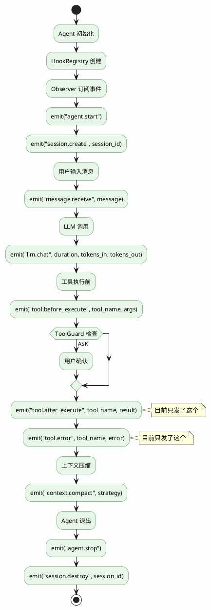
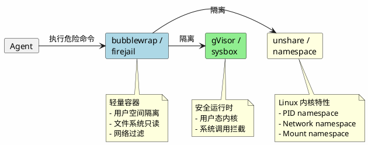
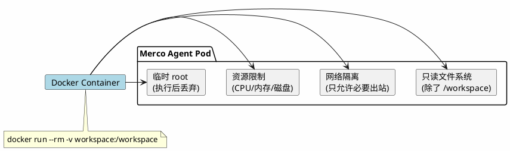
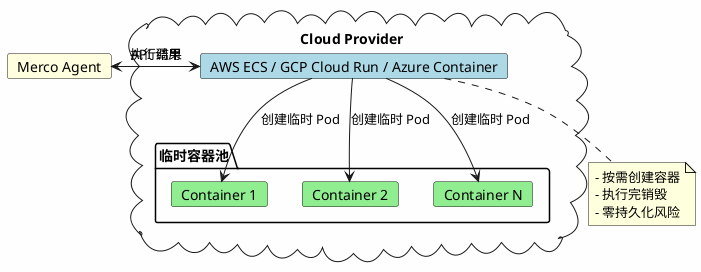

# 架构设计

## 必须保留的核心模块

| 模块 | 说明 |
|------|------|
| Agent-Loop | 主循环与工具调用调度 |
| Skills | 可扩展技能系统 |
| Tools | 文件/终端/网络等基础工具 |
| MCP | 模型上下文协议支持 |
| Memory | 自动记忆与召回 |
| Context | 上下文压缩与管理 |
| Hooks | 生命周期钩子 |
| Sandbox | 权限与沙箱控制 (目标: 容器化隔离) |
| Observability | 日志与可观测性 |
| Scheduler | 定时任务调度 |

### 可以裁剪的部分

- 过度抽象的配置系统
- 不常用的消息平台集成
- 复杂的插件加载机制
- 冗余的中间层封装

## 项目目录结构

```
merco/
├── core/           # 核心引擎 (agent, session, message, context, config, pipeline, setup, llm, self_healing)
├── tools/          # 工具系统 (registry, file, bash, web, task, mcp, skill, edit)
├── skills/         # 技能系统 (loader, registry, builtin/)
├── memory/         # 记忆系统 (store, recall, compressor, search, session_store)
├── hooks/          # 钩子系统 (registry, lifecycle, tool, chat)
├── sandbox/        # 沙箱环境 (permissions, isolation, security, guard, confirm, snapshot)
├── scheduler/      # 定时任务 (cron, jobs, delivery)
├── observability/  # 可观测性 (logger, metrics, tracing, audit, observer)
├── gateway/        # 消息网关 (base, telegram, discord, web)
└── utils/          # 工具函数

cli/                # CLI 入口 (main, commands, tui)
web/                # Web 界面 (FastAPI app)
tests/              # 测试 (unit, integration, fixtures, conftest)
docs/               # 文档
config/             # 配置示例
references/         # 参考源码 (git 忽略)
```

## 技术栈

- **语言**: Python 3.12+
- **包管理**: uv
- **异步**: asyncio / aiohttp
- **CLI**: typer / click
- **TUI**: textual / rich
- **Web**: fastapi
- **配置**: pydantic-settings
- **测试**: pytest

## 参考资料库

`references/` 文件夹包含三个核心参考项目 (git 忽略，不提交):

| 项目 | 路径 | 说明 |
|------|------|------|
| **Hermes Agent** | `references/hermes-agent/` | Nous Research 开发的自改进 AI Agent，具备记忆系统、Skill 自动创建、多平台网关等特性 |
| **OpenClaw** | `references/openclaw/` | 个人 AI 助手框架，支持多平台、插件系统、定时任务等 |
| **OpenCode** | `references/opencode/` | 终端 AI 编码助手，提供 TUI、Skill 系统、MCP 集成等 |

 实现功能时优先参考这些项目的源码。

## 模块集成架构

各子模块应通过 Agent Loop 完成调用链连接。**v0.2.0 状态：3 条主链已连接**：

```
Agent.run(prompt)
  │
  ├─ Hooks → emit("agent.start")                  ← Phase 6 计划
  ├─ Memory.Recall → 注入相关记忆                  ← Phase 5 计划
  ├─ Skills.RelevantSkills → 注入到 system prompt ← ⚠️ SkillViewTool 已接，get_relevant() keyword 匹配未注入
  ├─ SessionStore.resume_or_create() → 恢复会话    ← ✅ v0.2.0
  │
  └─ _agent_loop()
       │
       ├─ ToolGuard.check() → 拦截/确认/放行       ← ✅ v0.2.0 (30 条默认 ask 规则)
       ├─ Hooks → emit("llm.chat")                ← ✅ v0.2.0
       ├─ ToolRegistry.execute() + ToolHooks       ← ✅ v0.2.0
       ├─ Observer._on_tool() / _on_error()        ← ✅ v0.2.0 (订阅 hooks)
       ├─ Hooks → emit("tool.after_execute")      ← ✅ v0.2.0
       ├─ ResultPipeline.process()                 ← ✅ v0.2.0 (TruncationProcessor + SkillViewProcessor)
       │
       ├─ SessionStore.save_message()              ← ✅ v0.2.0 (增量写 SQLite)
       │
       ├─ RecoveryPipeline (LLM error 重试)        ← ✅ v0.2.0
       ├─ EmptyResponsePipeline (空回复回调)       ← ✅ v0.2.0
       │
       ├─ _ask_continuation() → LLM 自评续命       ← ✅ 已实现 (max_tool_calls)
       │
       └─ Memory.Store.save() → 持久化记忆         ← ❌ Phase 5 计划
```

## 架构模式

### Tool Error Resilience (registry try/except)

工具执行通过 `ToolRegistry.execute()` 统一入口。所有异常在此捕获并转为结构化错误：

```
TypeError → {error, available_params, received_params}  # LLM 自愈
Exception → {error: "TypeName: message"}                 # 通用兜底
```

错误以工具结果形式喂回 LLM，绝不 propagate 中断 agent 循环。

### Continuation Evaluation (_ask_continuation)

通用续命架构：任何预算耗尽时，让 LLM 自评是否继续。

```
触发点（max_tool_calls / retry_limit / token_budget / permission_deny）
  → _ask_continuation(limit_type, current, maximum)
    → 注入评估 prompt（无 tools）
    → LLM 回复 "CONTINUE:N" → 扩展预算，继续循环
    → LLM 回复 最终回答 → 直接返回
```

设计原则：
- 单一入口 `_ask_continuation()`，参数化决策 prompt
- LLM 是决策者而非执行机器
- 预算扩展后 context 不残留决策对话（CONTINUE 回复仅用于控制流）
- 可复用至任何资源限制场景

### Wrap-Up Pattern (_wrap_up_messages + _wrap_up_call)

工具预算耗尽收尾机制——历经 15+ 次迭代后的最终简洁方案。

```
循环顶部: if count >= max → _wrap_up_call(_wrap_up_messages(messages))
批量截停: if count + batch > max → _wrap_up_call(_wrap_up_messages(build()))
```

**核心方法：**
- `_wrap_up_messages(messages)` — 向消息列表末尾追加一条简短的 user 消息："已达到最大工具调用次数。请基于已有信息给出最终回复，不要再调用工具。"
- `_wrap_up_call(messages)` — 收尾调用：`tools=[]`, `tool_choice="none"`，LLM 纯文字回答

**提示词设计原则：** 放在最后（LLM 注意力最高）、简短（一条信息）、禁令优先（"不要再调用工具"放最后）、不解释（不列举选项）。

**四层幻觉防线：**
1. `tool_choice="none"` — API 层禁止
2. `tools=[]` — 无工具可选
3. `valid_names=set()` — 始终校验，不依赖 `if tools:`
4. regex `<\w+:tool_call[^>]*>...</\w+:tool_call>` — 清文本残留

**设计依据：** Hermes/Claude Code/Codex 都用大预算 + 简单收尾，不依赖 provider 特有能力。架构是通解，提示词是通解，但 provider 的 API 配合度是天花板——不要无限迭代 prompt，做好兜底。

**废弃的方案：** Hermes grace call（MiniMax 不配合）、system prompt 注入（被历史消息淹没）、多段式结构提示（越长越容易被复述）、精简消息（丢失上下文）。

### Observer Pattern (hooks 驱动的可观察性门面)

Observer 不直接埋点，而是订阅 HookRegistry 的事件流。业务代码只关心 `await self.hooks.emit(...)`，Observer/MetricsCollector/AuditLogger 各自订阅。

**核心结构**：

```python
class Observer:
    def __init__(self, hooks: HookRegistry):
        self._live = MetricsCollector()       # 当前运行
        self._acc_map: dict[str, int] = {}    # 跨运行累计

        hooks.on("llm.chat", self._on_llm)            # duration/tokens_in/out
        hooks.on("tool.after_execute", self._on_tool) # tool_name/duration
        hooks.on("tool.error", self._on_error)        # tool_name/error
        hooks.on("conversation.turn", self._on_turn)  # turn count
```

**双计数器（live + acc_map）**：
- `_live` — 当前运行（`/new` / `/sessions` 切换时 `reset()`）
- `_acc_map` — 跨运行累计（持久化到 `session.metadata` JSON 字段，重启时 `restore()`）

**累计公式 `_merge_to_acc()`**：
```python
for k, v in self._live.get_counters().items():
    self._acc_map[k] = self._acc_map.get(k, 0) + v
```

**设计原则**：
- **解耦**：业务代码零侵入式埋点，加新指标不改 agent.py
- **可组合**：MetricsCollector + AuditLogger + TracingSpan 可同时订阅同一事件
- **持久化**：Observer.snapshot() 存 session.metadata，重启不丢统计
- **多视角**：`/report` 命令同时显示本次（live）和累计（acc）数据

**对比直接埋点**：
- 旧：agent.py 导入 MetricsCollector，6+ 处 `metrics.increment("llm_calls")` 散落
- 新：agent.py 只 `await self.hooks.emit(...)`，Observer 订阅。改 1 行加新指标

### Hooks → Agent (事件发布订阅系统)

Hooks 是一个**事件发布订阅系统**——业务代码在关键节点发出事件，其他模块订阅这些事件来响应。解耦核心业务和辅助功能（可观察性、审计、日志等）。

**现状**：

| 事件 | 定义位置 | agent.py emit 了？ |
|------|----------|-------------------|
| `agent.start` | lifecycle.py | ❌ 没有 |
| `agent.stop` | lifecycle.py | ❌ 没有 |
| `session.create` | lifecycle.py | ❌ 没有 |
| `session.destroy` | lifecycle.py | ❌ 没有 |
| `message.receive` | chat_hooks.py | ❌ 没有 |
| `message.send` | chat_hooks.py | ❌ 没有 |
| `context.compact` | chat_hooks.py | ❌ 没有 |
| `tool.before_execute` | tool_hooks.py | ❌ 没有 |
| `tool.after_execute` | tool_hooks.py | ✅ 有 |
| `tool.error` | tool_hooks.py | ✅ 有 |
| `llm.chat` | (inline) | ✅ 有 |
| `conversation.turn` | (inline) | ✅ 有 |

骨架有了，但大部分事件没发出去，订阅者收不到通知。

**打通后的完整事件流**：



**需要加的 emit 位置**：

| 位置 | 事件 | 参数 |
|------|------|------|
| `__init__` 末尾 | `agent.start` | session_id |
| `__init__` 末尾 | `session.create` | session_id |
| `_agent_loop` 开始 | `message.receive` | message |
| `_execute_tool_calls` 开始 | `tool.before_execute` | tool_name, args |
| `_compress_context` | `context.compact` | strategy |
| `run` 退出路径 | `agent.stop` | - |
| `run` 退出路径 | `session.destroy` | session_id |

**订阅者示例**（用于可观察性、审计等）：

```plantuml
@startuml
skinparam backgroundColor #FEFEFE

rectangle "Agent Loop" as Agent {
  :emit("llm.chat")
  :emit("tool.before_execute")
  :emit("tool.after_execute")
  :emit("tool.error")
}

rectangle "HookRegistry" as Hooks {
  database "事件表" as events
}

rectangle "订阅者" as Subscribers {
  card "Observer\n(可观察性)" as Observer
  card "AuditLogger\n(审计日志)" as Audit
  card "TracingSpan\n(链路追踪)" as Tracing
}

Agent -> Hooks : emit(event)
Hooks -> Observer : on(event)
Hooks -> Audit : on(event)
Hooks -> Tracing : on(event)

@enduml
```

### ToolGuard (规则链守卫)

工具执行前的细粒度敏感命令守卫。每条规则 = `tool + pattern + action`，链式匹配首个命中生效。

**核心结构**：

```python
@dataclass
class GuardRule:
    tool: str     # "bash" | "write_file" | "*" 所有工具
    pattern: str
    action: str   # "ask" | "deny" | "allow"

class ToolGuard:
    def __init__(self, mode="ask", user_rules=None):
        self.mode = mode
        self._rules = [] + _DEFAULT_RULES  # user 规则优先级最高

    async def check(self, tool_name, arguments) -> bool:
        """返回 True=放行"""
```

**30 条默认 ask 规则**（覆盖 rm/sudo/pip/docker/system 敏感点）：

```python
_DEFAULT_RULES = [
    GuardRule("bash", "rm -rf /", "ask"),
    GuardRule("bash", "sudo ", "ask"),
    GuardRule("bash", "git push", "ask"),
    GuardRule("bash", "pip install", "ask"),
    GuardRule("bash", "docker rm", "ask"),
    # ... 30 条
]
```

**配置扩展**（merco.json）：

```json
{
  "sandbox_mode": "ask",  // "ask" | "auto" | "deny"
  "sandbox_rules": [
    {"tool": "bash", "pattern": "DROP TABLE", "action": "deny"}
  ]
}
```

**设计原则**：
- **默认 ask 不硬拦截** — 阻断正常开发不如让用户决策
- **规则链优先级** — user 规则在链首，用户可覆盖默认
- **ToolGuard.check() 由 agent 集成** — 工具自身不感知，业务解耦
- **可拓展到任意工具** — 不仅 bash，可约束 write_file/edit_file

**接入位置**（agent.py:474）：
```python
approved = await self.guard.check(tool_name, arguments)
if not approved:
    result = {"error": "操作已被拦截或取消"}
elif self.tool_registry:
    result = await self.tool_registry.execute(tool_name, **arguments)
```

### SessionStore (SQLite 持久化)

SQLite 会话存储替代 JSON 文件，支持并发读 + 增量写 + 全文检索。

**表结构**：

```sql
CREATE TABLE sessions (
    id            TEXT PRIMARY KEY,
    title         TEXT DEFAULT '',
    created_at    TEXT NOT NULL,
    updated_at    TEXT NOT NULL,
    message_count INTEGER DEFAULT 0,
    parent_id     TEXT,              -- 支持 Session Fork（Phase 5）
    metadata      TEXT DEFAULT '{}'  -- Observer snapshot 存在这
);

CREATE TABLE messages (
    id            INTEGER PRIMARY KEY AUTOINCREMENT,
    session_id    TEXT NOT NULL,
    role          TEXT NOT NULL,
    content       TEXT DEFAULT '',
    tool_call_id  TEXT DEFAULT '',
    tool_calls    TEXT DEFAULT '[]', -- 完整 tool call 链路
    reasoning     TEXT DEFAULT '',
    timestamp     TEXT NOT NULL,
    FOREIGN KEY (session_id) REFERENCES sessions(id)
);

CREATE INDEX idx_msg_session ON messages(session_id, id);
```

**关键设计**：
- **WAL 模式** (`PRAGMA journal_mode=WAL`) — 并发读 + 单写，性能 > 默认 rollback
- **FOREIGN KEY** — 删 session 联动删 messages
- **增量写** — `count_messages` 查 DB 已有 N 条，只写 `messages[N:]`
- **metadata JSON 字段** — Observer snapshot 存这，重启不丢统计
- **parent_id 字段** — 预留 Session Fork（Phase 5 启用）

**接入位置**（agent.py:234-236）：

```python
from merco.memory.session_store import SessionStore
self._session_store = SessionStore(_get_db_path())  # ~/.merco/sessions.db
self.session = Session.resume_or_create(self._session_store)
self._restore_context()  # 从 SQLite 灌入历史消息 + observer.restore()
```

**Session 生命周期**：
1. 启动 → `resume_or_create()` 自动恢复上次会话
2. 每轮 → `session.add_message()` 不立即写盘
3. 循环结束 → `session.save()` 增量写 + `save_metadata(observer.snapshot())`
4. `/new` / 退出 → 合并 live→acc → 持久化

**对比 JSON 文件**：
- 旧：每轮 `json.dump` 全量，1MB 会话 = 1MB IO × N 轮
- 新：增量写 1-2 条消息 = 几十字节 IO

### Sandbox 扩展路线（从规则守卫到容器隔离）

当前 `ToolGuard` 不是真正的沙箱——它只是**规则匹配 + 用户确认**，无法提供进程级隔离。

**现状**：

| 文件 | 状态 |
|------|------|
| `guard.py` | ✅ 规则守卫（已接通 Tools） |
| `isolation.py` | 🟡 目录白名单（骨架，未接入） |
| `permissions.py` | 🟡 权限管理（骨架） |
| `security.py` | ✅ SecurityChecker 正则检测 |
| `confirm.py` | ✅ 确认 UI |
| `snapshot.py` | ✅ 快照（中断恢复用） |

**扩展路线**：

#### 阶段 1: 本地增强（轻量）

```plantuml
@startuml
skinparam backgroundColor #FEFEFE

box "当前架构"
  component "ToolGuard\n(规则匹配)" as Guard #LightGreen
end box

box "接上 SandboxIsolation"
  component "SandboxIsolation\n(目录白名单)" as Isolation #LightYellow
  component "work_dir = /tmp/merco_xxx" as TempDir
end box

Guard -> Isolation : 检查路径
Isolation -> TempDir : 限制访问

note top of Isolation
  - 只允许读写 /home/user/project
  - write_file 只在允许目录
end note

@enduml
```

实现：在 `ToolRegistry.execute()` 调目录检查。

#### 阶段 2: 进程级隔离



用 subprocess 调 bubblewrap 包装 bash 执行。

#### 阶段 3: Docker 容器（本地/远程）



#### 阶段 4: 云上容器



对接 AWS/GCP 的容器服务 API，创建临时容器执行工具。

**扩展点汇总**：

| 扩展 | 实现方式 | 难度 |
|------|----------|------|
| 接上 SandboxIsolation | 在 ToolRegistry.execute() 调目录检查 | ⭐ |
| bubblewrap 封装 | 用 subprocess 调 bubblewrap 包装 bash 执行 | ⭐⭐ |
| Docker 容器 | 用 `docker run --rm -v workspace:/workspace` | ⭐⭐ |
| 远程 Docker API | 对接 cloud provider API 创建临时容器 | ⭐⭐⭐ |
| Kubernetes Pod | 临时 Pod + exec 到容器内执行 | ⭐⭐⭐ |
