# 架构设计

## 项目目录结构

```
merco/
├── core/           # 核心引擎 (agent, llm/, config, session, message, context,
│                   #             pipeline, recovery/, interrupt, self_healing,
│                   #             empty_response, loop_policy)                    🟢 POLISHED
├── tools/          # 工具系统 (registry, bash_tools, file_tools, edit,
│                   #             web_tools, mcp_tools, skill_tools, task_tools,
│                   #             errors, middleware, recovery, base, processors/)  🟢 POLISHED
├── skills/         # 技能系统 (loader, registry, builtin/merco/SKILL.md)         🟢 POLISHED
├── memory/         # 记忆系统 (store, recall, save_pipeline, strategy,
│                   #             session_store, backend, backends/, search,
│                   #             session_search)                                   🟢 POLISHED
├── hooks/          # 钩子系统 (registry, lifecycle, tool_hooks, chat_hooks)     🟢 POLISHED
├── sandbox/        # 沙箱环境 (guard, security, confirm, snapshot)              🟢 POLISHED
├── scheduler/      # 定时任务 (cron, jobs, delivery)                            🟢 POLISHED
├── observability/  # 可观测性 (observer, metrics, audit, logger, tracing)       🟢 POLISHED
├── plugins/        # 插件系统 (base[Plugin/PluginSpec/PluginContext], discovery,
│                   #             manager, builtin/{mcp,observability,scheduler,
│                   #             skills,subagent,web,superpower})                🟢 NEW
├── context/        # 上下文处理 (pipeline, processors/, recovery)               🟢 NEW
├── agents/         # 子 Agent 管理 (subagent, profile)                          🟢 NEW
├── todo/           # 待办事项 (manager, models)                                 🟢 NEW
├── mcp/            # MCP 客户端 (manager, config, tool)                         🟢 POLISHED
├── gateway/        # 消息网关 (预留)                                           ⚪ LEGACY
└── utils/          # 工具函数                                                 ⚪ UTIL

cli/                # CLI 入口 (main, commands, input_driver, interrupt,
│                   #             registry, tui)                                  🟢 POLISHED
web/                # Web 界面 (FastAPI app, 预留)                               ⚪ LEGACY
tests/              # 测试 (core, mcp, observability, cli, integration, unit)
docs/               # 文档
config/             # 配置示例
references/         # 参考源码 (git 忽略)
```

**图例：**
- 🟢 POLISHED — 功能完整，经过测试验证
- 🟢 NEW — 新增模块，功能实现
- ⚪ LEGACY — 历史模块，功能未完善
- ⚪ UTIL — 工具模块，无业务状态

## 模块状态总览

| 模块 | 状态 | 说明 |
|------|------|------|
| Agent Loop | 🟢 POLISHED | 主循环与工具调用调度，完整实现 |
| Skills | 🟢 POLISHED | 技能系统，14 个 superpowers 技能已安装 |
| Tools | 🟢 POLISHED | 文件/终端/网络/Skill/MCP/Task 等工具 |
| MCP | 🟢 POLISHED | MCPServerManager + MCPPlugin 完整实现 |
| Memory | 🟢 POLISHED | Save (Pipeline+Strategy) + Recall (HybridRecaller) 双链路 |
| Context | 🟢 NEW | ContextPipeline + CompressProcessor + CacheOptimizeProcessor |
| Hooks | 🟢 POLISHED | HookRegistry，15+ 事件类型全链路接入 |
| Sandbox | 🟢 POLISHED | ToolGuard + SecurityChecker + Confirm + Snapshot |
| Observability | 🟢 POLISHED | Observer 全链路接入，metrics/audit/tracing |
| Scheduler | 🟢 POLISHED | CronScheduler + SchedulerPlugin 接入 Agent 生命周期 |
| Plugins | 🟢 NEW | Plugin + PluginSpec + PluginContext + PluginDiscovery，21 扩展点 + 5 便捷方法，8 个内置插件（entry_points 动态发现） |
| SubAgent | 🟢 NEW | SubAgentManager + AgentProfile + AgentProfileRegistry |
| Todo | 🟢 NEW | TodoItem + TodoManager，支持子任务分解 |
| Gateway | 🟢 NEW | GatewayAdapter ABC + GatewayRegistry + WebhookGateway 参考适配器 + GatewayPlugin；AgentRuntime 统一宿主生命周期（start/stop/submit/handle_inbound） |
| Utils | ⚪ UTIL | 通用工具函数 |

## 技术栈

- **语言**: Python 3.12+
- **包管理**: uv
- **异步**: asyncio / aiohttp
- **CLI**: typer / prompt_toolkit
- **TUI**: textual (skeleton)
- **Web**: fastapi (预留)
- **配置**: pydantic-settings
- **测试**: pytest
- **代码质量**: ruff（lint + format），pre-commit 钩子强制（`.pre-commit-config.yaml`，`uv run ruff` 本地 hook 防版本漂移）

## 参考资料库

`references/` 文件夹包含三个核心参考项目 (git 忽略，不提交):

| 项目 | 路径 | 说明 |
|------|------|------|
| **Hermes Agent** | `references/hermes-agent/` | Nous Research 开发的自改进 AI Agent，具备记忆系统、Skill 自动创建、多平台网关等特性 |
| **OpenClaw** | `references/openclaw/` | 个人 AI 助手框架，支持多平台、插件系统、定时任务等 |
| **OpenCode** | `references/opencode/` | 终端 AI 编码助手，提供 TUI、Skill 系统、MCP 集成等 |

实现功能时优先参考这些项目的源码。

---

## 1. 整体系统架构图

```plantuml
@startuml
skinparam backgroundColor #FEFEFE
skinparam componentStyle rectangle
skinparam packageStyle rectangle
skinparam note {
  BackgroundColor #FFF8E1
  BorderColor #FF8F00
}

package "merco" {
  rectangle "CLI\n(main.py)" as CLI #LightBlue

  rectangle "AgentRuntime\n(runtime.py)" as Runtime #LightBlue
  note right of Runtime
    生命周期宿主：owns Agent + CronScheduler + GatewayRegistry
    - start/stop（幂等）
    - submit / handle_inbound -> agent.run
  end note

  rectangle "Agent Loop\n(agent.py)" as Agent #LightGreen
  note right of Agent
    主心骨：协调所有子系统
    - 生命周期管理
    - 工具调用循环
    - 上下文管理
  end note

  package "核心模块" {
    rectangle "LLM\n(llm/)" as LLM #LightYellow
    rectangle "Config\n(config.py)" as Config #LightYellow
    rectangle "Session\n(session.py)" as Session #LightYellow
    rectangle "Context\n(context.py)" as SessionContext #LightYellow
  }

  package "工具层" {
    rectangle "ToolRegistry" as Registry #LightGray
    rectangle "ToolGuard" as Guard #LightGray
    rectangle "Tools\n(bash/file/web/mcp/...)" as Tools #LightGray
  }

  package "记忆层" {
    rectangle "MemorySave\n(Pipeline + Strategy)" as MemorySave #LightGray
    rectangle "MemoryRecall\n(HybridRecaller)" as MemoryRecall #LightGray
    rectangle "SessionStore\n(SQLite)" as SessionStore #LightGray
  }

  package "扩展层" {
    rectangle "Hooks\n(15 事件)" as Hooks #LightGray
    rectangle "Plugins\n(8 内置插件, entry_points)" as Plugins #LightGray
    rectangle "Scheduler\n(CronScheduler)" as Scheduler #LightGray
    rectangle "GatewayRegistry\n(GatewayAdapter ABC)" as GatewayRegistry #LightGray
    rectangle "Observer\n(全链路接入)" as Observer #LightGray
  }

  package "子模块" {
    rectangle "MCP\n(MCPServerManager)" as MCP #LightGray
    rectangle "Skills\n(SkillLoader/Registry)" as Skills #LightGray
    rectangle "SubAgent\n(SubAgentManager)" as SubAgent #LightGray
    rectangle "Todo\n(TodoManager)" as Todo #LightGray
    rectangle "ContextPipeline\n(Compress/Cache)" as ContextPipeline #LightGray
  }
}

CLI --> Runtime
Runtime --> Agent
Agent --> LLM
Agent --> Config
Agent --> Session
Agent --> SessionContext

Agent --> Registry
Registry --> Guard
Registry --> Tools

Agent --> MemorySave
Agent --> MemoryRecall
Agent --> SessionStore

Agent --> Hooks
Agent --> Plugins
Runtime --> Scheduler
Runtime --> GatewayRegistry
Agent --> Observer

Agent --> MCP
Agent --> Skills
Agent --> SubAgent
Agent --> Todo
Agent --> ContextPipeline

note right of MemorySave
  Save 链路：
  Strategy → Pipeline → Hooks.emit("memory.saved")
end note

note right of MemoryRecall
  Recall 链路：
  HybridRecaller → FTS5 + JSON → 注入 context
end note

note right of Plugins
  PluginContext 接入：
  - MCP Plugin
  - Observability Plugin
  - Scheduler Plugin
  - Skills Plugin
  - SubAgent Plugin
  - Web Plugin
  - Superpower Plugin
  - Gateway Plugin
end note

@enduml
```

---

## 2. 插件系统架构图

> **扩展点说明**：插件系统有两套扩展机制：
> - **PluginContext 属性（21个）**：代码层面直接注入的子系统引用 + 5 个便捷方法
> - **Hook 事件扩展点（15个）**：生命周期事件，插件可订阅

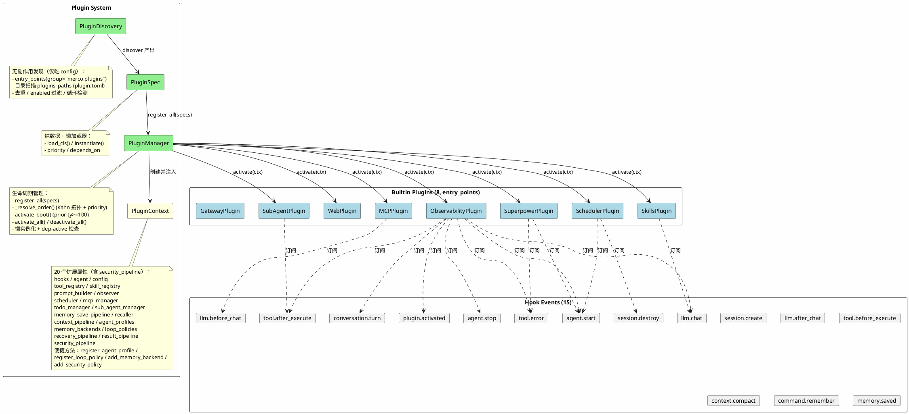

### 插件动态加载流程

**设计意图**：可动态拓展——向 `./.merco/plugins/` 或 `~/.config/merco/plugins/` 丢一个含 `plugin.toml` + `main.py` 的目录即被自动发现、拓扑排序、激活，经便捷方法访问全部扩展点；架构分层清爽。

**加载链路**：
1. **`PluginDiscovery`**（无副作用，仅吃 `config`）——两源发现：
   - `entry_points(group="merco.plugins")`：从 Plugin 子类的 `priority`/`depends_on` 类属性读元数据；
   - `config.plugins_paths` 目录扫描：解析子目录 `plugin.toml`，`entry = "module:Class"` 经 `importlib.util.spec_from_file_location` 加载（零 `sys.path` 污染，支持单文件插件）。
   - 目录扫描同名覆盖 entry_points；`enabled` 过滤；DFS 循环检测 + 存在性闭包剪枝。
2. **`PluginSpec`**（纯数据 + 懒加载器）：`load_cls()` 缓存 `_cls`，`instantiate()` 缓存 `_instance`。
3. **`PluginManager.register_all(specs)`**：注册全部 spec。
4. **`_resolve_order(names, boot_only)`**：Kahn 拓扑排序，`(-priority, name)` tiebreak，存在性闭包，循环排除。
5. **两阶段 boot**（`agent.py`）：`activate_boot()`（激活 `priority >= 100`，如 Observability）-> 绑定 `self.observer = ctx.observer` -> `_restore_context()` -> `activate_all()`（剩余按拓扑序激活，dep 未激活则跳过并 emit `plugin.error`）。

7 个 builtin 现为"普通插件"——agent.py 零 `from merco.plugins.builtin.*` 导入、零特殊分支，boot 序完全由 `priority` 数据驱动。

---

## 3. 上下文处理管道图

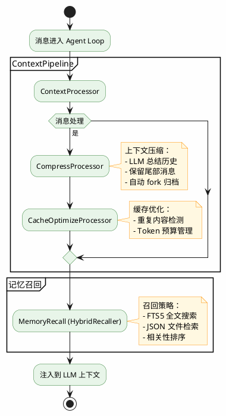

---

## 4. 记忆系统架构图（Save + Recall 双链路）

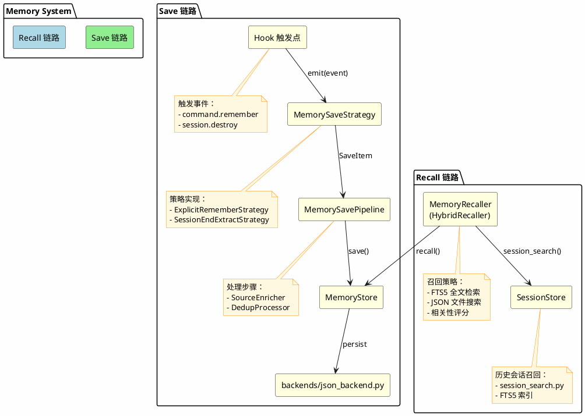

---

## 5. 事件驱动架构图（Hooks 发布订阅）

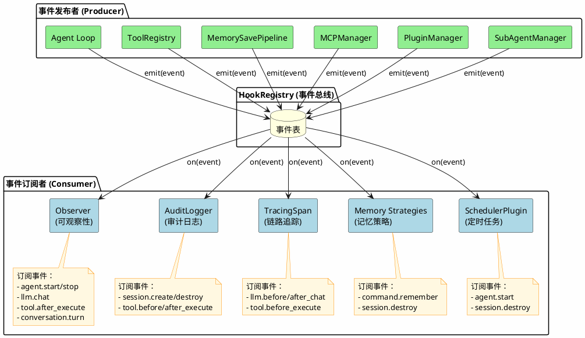

---

## 模块集成架构

Agent Loop 作为主心骨，协调所有子系统调用链：

```
Agent.run(prompt)
  │
  ├─ Hooks → emit("agent.start")                    ← ✅ v0.3.0
  ├─ Hooks → emit("session.create")                 ← ✅ v0.3.0
  ├─ Hooks → emit("message.receive")                ← ✅ v0.3.0
  │
  ├─ Plugins.on_init()                              ← ✅ PluginContext
  ├─ Memory.Recall → 注入相关记忆                   ← ✅ HybridRecaller
  ├─ Skills.RelevantSkills → 注入到 system prompt   ← ✅ SkillViewTool
  ├─ SessionStore.resume_or_create() → 恢复会话     ← ✅ v0.2.0
  │
  └─ _agent_loop()
       │
       ├─ Hooks → emit("llm.before_chat")           ← ✅ v0.3.0
       ├─ LLM.chat()                                ← ✅ v0.1.0
       ├─ Hooks → emit("llm.chat")                  ← ✅ v0.2.0
       ├─ Hooks → emit("llm.after_chat")            ← ✅ v0.3.0
       │
       ├─ Hooks → emit("conversation.turn")         ← ✅ v0.3.0
       │
       ├─ ToolGuard.check() → 拦截/确认/放行        ← ✅ v0.2.0 (30 条默认 ask 规则)
       ├─ Hooks → emit("tool.before_execute")       ← ✅ v0.3.0
       ├─ ToolRegistry.execute() + ToolHooks        ← ✅ v0.2.0
       ├─ Observer._on_tool() / _on_error()         ← ✅ v0.2.0 (订阅 hooks)
       ├─ Hooks → emit("tool.after_execute")        ← ✅ v0.2.0
       ├─ Hooks → emit("tool.error")                ← ✅ v0.2.0
       │
       ├─ ResultPipeline.process()                  ← ✅ v0.2.0
       │    (TruncationProcessor + SkillViewProcessor)
       │
       ├─ SessionStore.save_message()               ← ✅ v0.2.0 (增量写 SQLite)
       │
       ├─ RecoveryPipeline (LLM error 重试)         ← ✅ v0.2.0
       ├─ EmptyResponsePipeline (空回复回调)        ← ✅ v0.2.0
       │
       ├─ _ask_continuation() → LLM 自评续命        ← ✅ max_tool_calls
       │
       ├─ ContextPipeline.process()                 ← ✅ v0.3.0
       │    (CompressProcessor + CacheOptimizeProcessor)
       ├─ Hooks → emit("context.compact")           ← ✅ v0.3.0
       │
       ├─ Memory.SavePipeline → 持久化记忆          ← ✅ v0.3.0
       │    (Strategy + Pipeline + Hook 模式)
       │
       └─ Hooks → emit("agent.stop")                ← ✅ v0.3.0
            emit("session.destroy")                  ← ✅ v0.3.0
```

---

## 模型层架构（ModelProvider / ModelRegistry）

波2 重构后，`merco/core/llm/` 从单文件 `_client.py` 演进为 provider ABC + registry 架构，镜像插件动态化分层（ABC -> 元数据 -> registry -> 具体 provider -> agent 懒属性）。Agent 不再硬编码 OpenAI 客户端，而是经 `ModelRegistry.select()` 拿到具体 provider。

### 目录布局

| 模块 | 职责 |
|------|------|
| `base.py` | `ModelProvider` ABC（`chat`/`chat_stream`/`info` 契约）+ `ModelProviderInfo` dataclass（name/provider_class/display_name/base_url/key_env/key_help/default_model/models/description，纯元数据 + 懒加载器）。 |
| `registry.py` | `ModelRegistry` 单一真相源：`register/get/list/select`。`select(config)` **拥有凭证解析**（读 `key_env` -> env -> config -> `ModelConfig.api_key`），agent/config 不再各自补 base_url/api_key。`_BUILTIN_PROVIDERS` 预置 OpenAICompatible/AnthropicNative。 |
| `openai_provider.py` | `OpenAICompatibleProvider` 吸收旧 `LLMClient` transport（`AsyncOpenAI` 构造 + chat/chat_stream + tool_calls 解析 + None 字段防护）；拥有 `translate_openai_error`（SDK 异常 -> `ProviderError`）。 |
| `anthropic_provider.py` | `AnthropicNativeProvider` 原生 Messages API（非 OpenAI 兼容 shim），**证明 ABC 不被 OpenAI 形状绑架**；拥有 `translate_anthropic_error`。 |
| `thinking.py` | `ThinkingExtractor` 策略链（reasoning 字段提取，纯提取自旧 `_client.py`）。 |
| `response.py` | `ResponseProvider` + `StreamingProvider`/`NonStreamingProvider`（流式/非流式双模式，纯提取自 `agent.py`）。 |
| `errors.py` | SDK 无关的 `ProviderError` 层级（`RateLimitError`/`AuthError`/`ConnectionError`/`ModelNotFoundError`，携带 `status_code`）。**不 import 任何 SDK**--`translate_*_error` 已移入各 provider 文件。保留 `llm_error` 兼容包装。 |
| `error_ui.py` | `classify_error`/`error_message`/`build_error_panel`/`build_retry_line`--按 `status_code` + 异常类名分类 + Rich 红 Panel 渲染 + 重试反馈。 |

### 关键设计

- **`agent.provider` 懒属性**：首次访问时 `ModelRegistry.select(config.model)` 实例化 provider 并缓存到 `_model_provider`/`_response_provider`；setter 走 `switch_model`（跨 provider 修复：构造新 `ModelConfig` 触发 re-select，而非假设同 client）。SubAgent 覆盖 `config.model` 即自动 re-select，无需额外代码。
- **`agent.model_registry`**：agent 持有 registry 引用，`switch_model` / recovery 均经此拿 provider。
- **`PluginContext.model_registry`**：第三方扩展点。插件经 `ctx.register_model_provider(ProviderClass)` 注入自有 provider，agent 无需感知。
- **`PluginContext.gateway_registry`**：第三方扩展点（Wave 3）。插件经 `ctx.register_gateway(adapter)` 注入自有 `GatewayAdapter`，`AgentRuntime.start()` 统一 `set_inbound_handler` + `start_all()`。
- **`AgentRuntime` 生命周期宿主**：薄宿主，owns Agent + CronScheduler + GatewayRegistry。`start()` 触发 `Agent.create`（含插件两阶段激活）+ gateway/scheduler 起；`stop()` 幂等收尾。turn-loop 留在 `agent.py`，宿主只做 `submit`/`handle_inbound` -> `agent.run` 路由。CLI 单事件循环：`_setup_agent` sync 返回未启动 Runtime，`repl()` 内 `await runtime.start()`/`stop()`。
- **每个 provider 拥有自己的 SDK error mapping**：`translate_openai_error`/`translate_anthropic_error` 各居其 provider 文件，`errors.py` 保持 SDK 无关--agent 与 `error_ui` 永不 import SDK。
- **凭证解析归 `ModelRegistry.select()` 独占**：`ModelConfig` 退化为纯数据（删 `resolve()`/`stream_options`），`_get_api_key` 删除。

---

## Agent Loop 详细流程图

以下是 Agent Loop 的完整执行流程，展示了从用户输入到最终输出的所有关键步骤和 Hook 事件：

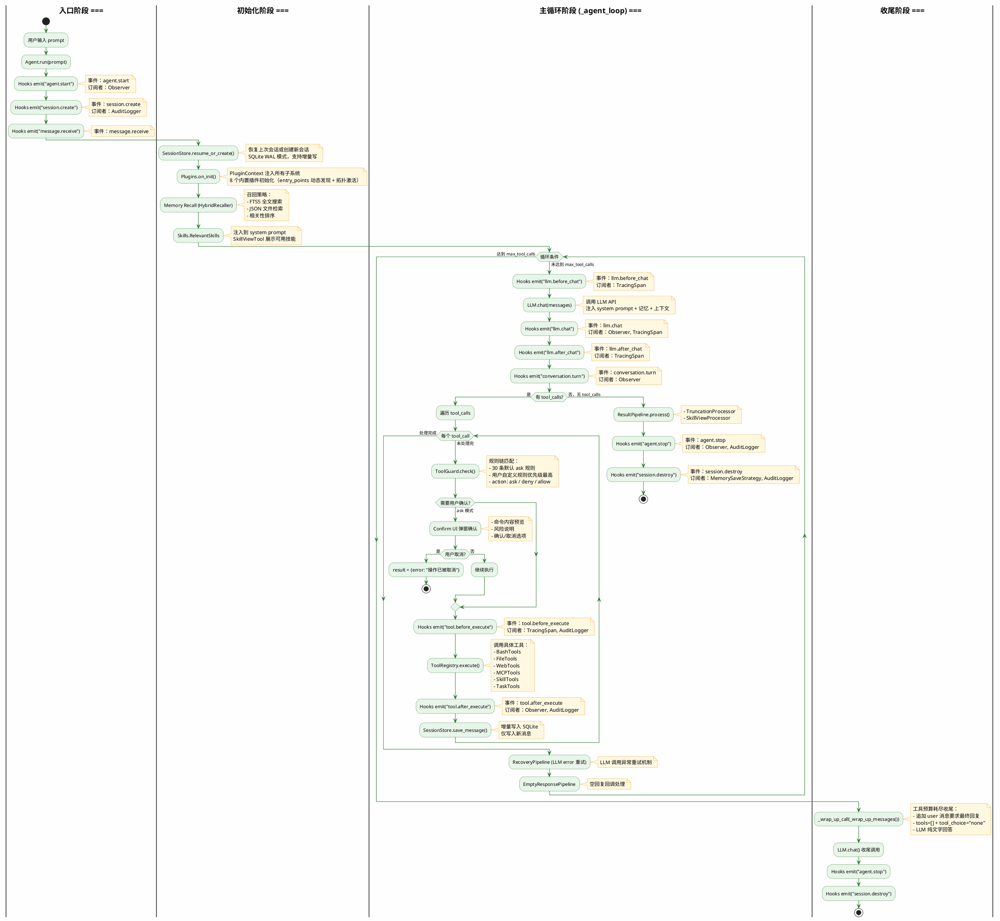

**流程说明：**

| 阶段 | 组件 | 说明 |
|------|------|------|
| **入口** | Agent.run() | 接收用户输入，触发 start/session/create/message.receive 事件 |
| **初始化** | SessionStore | 恢复或创建会话，加载历史消息 |
| **初始化** | Memory Recall | HybridRecaller 召回相关记忆注入上下文 |
| **初始化** | Skills | 注入相关技能到 system prompt |
| **主循环** | LLM.chat() | 调用 LLM，支持 tool_calls 循环 |
| **主循环** | ToolGuard | 规则链匹配，决定放行/拦截/询问 |
| **主循环** | ToolRegistry | 执行具体工具，异常捕获转为结构化错误 |
| **主循环** | ContextPipeline | 上下文压缩与缓存优化 |
| **收尾** | Wrap-Up Pattern | 工具预算耗尽时强制 LLM 输出最终回答 |

**Hook 事件时序：**

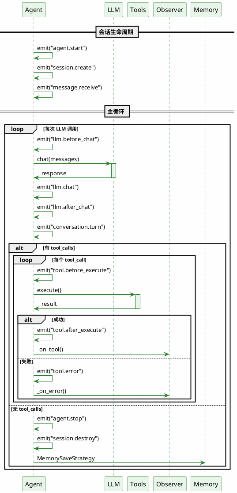

---

## Hooks 事件完整状态表

| 事件 | 定义位置 | agent.py emit | 其他模块 emit | 订阅者 |
|------|----------|---------------|---------------|--------|
| `agent.start` | lifecycle.py | ✅ | - | Observer |
| `agent.stop` | lifecycle.py | ✅ | - | Observer, AuditLogger |
| `session.create` | lifecycle.py | ✅ | - | AuditLogger |
| `session.destroy` | lifecycle.py | ✅ | - | MemorySaveStrategy, AuditLogger |
| `message.receive` | chat_hooks.py | ✅ | - | - |
| `llm.before_chat` | (inline) | ✅ | - | TracingSpan |
| `llm.chat` | (inline) | ✅ | - | Observer, TracingSpan |
| `llm.after_chat` | (inline) | ✅ | - | TracingSpan |
| `tool.before_execute` | tool_hooks.py | ✅ | - | TracingSpan, AuditLogger |
| `tool.after_execute` | tool_hooks.py | ✅ | - | Observer, AuditLogger |
| `tool.error` | tool_hooks.py | ✅ | - | Observer |
| `context.compact` | chat_hooks.py | ✅ | - | - |
| `conversation.turn` | (inline) | ✅ | - | Observer |
| `memory.saved` | (inline) | - | MemorySavePipeline | - |
| `memory.failed` | (inline) | - | MemorySavePipeline | - |
| `subagent.completed` | (inline) | - | SubAgentManager | - |
| `mcp.connect` | (inline) | - | MCPServerManager | - |
| `mcp.tool_call` | (inline) | - | MCPServerManager | - |
| `mcp.error` | (inline) | - | MCPServerManager | - |
| `plugin.activated` | (inline) | - | PluginManager | 激活成功后 emit |
| `plugin.deactivated` | (inline) | - | PluginManager | 停用后 emit |
| `plugin.error` | (inline) | - | PluginManager | 激活/实例化失败或 dep 未激活时 emit |

**状态：大部分事件已实现并 emit，仅 memory.* 事件仅被 save_pipeline emit 而无订阅者。**

---

## 架构模式

### Tool Error Resilience (registry try/except)

工具执行通过 `ToolRegistry.execute()` 统一入口。所有异常在此捕获并转为结构化错误：

```
TypeError → {error, available_params, received_params}  # LLM 自愈
Exception → {error: "TypeName: message"}                 # 通用兜底
```

错误以工具结果形式喂回 LLM，绝不 propagate 中断 agent 循环。

### Continuation Evaluation (_ask_continuation)

通用续命架构：任何预算耗尽时，让 LLM 自评是否继续。

```
触发点（max_tool_calls / retry_limit / token_budget / permission_deny）
  → _ask_continuation(limit_type, current, maximum)
    → 注入评估 prompt（无 tools）
    → LLM 回复 "CONTINUE:N" → 扩展预算，继续循环
    → LLM 回复 最终回答 → 直接返回
```

设计原则：
- 单一入口 `_ask_continuation()`，参数化决策 prompt
- LLM 是决策者而非执行机器
- 预算扩展后 context 不残留决策对话（CONTINUE 回复仅用于控制流）
- 可复用至任何资源限制场景

### Wrap-Up Pattern (_wrap_up_messages + _wrap_up_call)

工具预算耗尽收尾机制——历经 15+ 次迭代后的最终简洁方案。

```
循环顶部: if count >= max → _wrap_up_call(_wrap_up_messages(messages))
批量截停: if count + batch > max → _wrap_up_call(_wrap_up_messages(build()))
```

**核心方法：**
- `_wrap_up_messages(messages)` — 向消息列表末尾追加一条简短的 user 消息："已达到最大工具调用次数。请基于已有信息给出最终回复，不要再调用工具。"
- `_wrap_up_call(messages)` — 收尾调用：`tools=[]`, `tool_choice="none"`，LLM 纯文字回答

**提示词设计原则：** 放在最后（LLM 注意力最高）、简短（一条信息）、禁令优先（"不要再调用工具"放最后）、不解释（不列举选项）。

**四层幻觉防线：**
1. `tool_choice="none"` — API 层禁止
2. `tools=[]` — 无工具可选
3. `valid_names=set()` — 始终校验，不依赖 `if tools:`
4. regex `<\w+:tool_call[^>]*>...</\w+:tool_call>` — 清文本残留

**设计依据：** Hermes/Claude Code/Codex 都用大预算 + 简单收尾，不依赖 provider 特有能力。架构是通解，提示词是通解，但 provider 的 API 配合度是天花板——不要无限迭代 prompt，做好兜底。

**废弃的方案：** Hermes grace call（MiniMax 不配合）、system prompt 注入（被历史消息淹没）、多段式结构提示（越长越容易被复述）、精简消息（丢失上下文）。

### Observer Pattern (hooks 驱动的可观察性门面)

Observer 不直接埋点，而是订阅 HookRegistry 的事件流。业务代码只关心 `await self.hooks.emit(...)`，Observer/MetricsCollector/AuditLogger 各自订阅。

**核心结构：**

```python
class Observer:
    def __init__(self, hooks: HookRegistry):
        self._live = MetricsCollector()       # 当前运行
        self._acc_map: dict[str, int] = {}    # 跨运行累计

        hooks.on("llm.chat", self._on_llm)            # duration/tokens_in/out
        hooks.on("tool.after_execute", self._on_tool) # tool_name/duration
        hooks.on("tool.error", self._on_error)        # tool_name/error
        hooks.on("conversation.turn", self._on_turn)  # turn count
```

**双计数器（live + acc_map）：**
- `_live` — 当前运行（`/new` / `/sessions` 切换时 `reset()`）
- `_acc_map` — 跨运行累计（持久化到 `session.metadata` JSON 字段，重启时 `restore()`）

**累计公式 `_merge_to_acc()`**：
```python
for k, v in self._live.get_counters().items():
    self._acc_map[k] = self._acc_map.get(k, 0) + v
```

**设计原则：**
- **解耦**：业务代码零侵入式埋点，加新指标不改 agent.py
- **可组合**：MetricsCollector + AuditLogger + TracingSpan 可同时订阅同一事件
- **持久化**：Observer.snapshot() 存 session.metadata，重启不丢统计
- **多视角**：`/report` 命令同时显示本次（live）和累计（acc）数据

**对比直接埋点：**
- 旧：agent.py 导入 MetricsCollector，6+ 处 `metrics.increment("llm_calls")` 散落
- 新：agent.py 只 `await self.hooks.emit(...)`，Observer 订阅。改 1 行加新指标

---

## ToolGuard (规则链守卫)

工具执行前的细粒度敏感命令守卫。每条规则 = `tool + pattern + action`，链式匹配首个命中生效。

**核心结构：**

```python
@dataclass
class GuardRule:
    tool: str     # "bash" | "write_file" | "*" 所有工具
    pattern: str
    action: str   # "ask" | "deny" | "allow"

class ToolGuard:
    def __init__(self, mode="ask", user_rules=None):
        self.mode = mode
        self._rules = [] + _DEFAULT_RULES  # user 规则优先级最高

    async def check(self, tool_name, arguments) -> bool:
        """返回 True=放行"""
```

**30 条默认 ask 规则**（覆盖 rm/sudo/pip/docker/system 敏感点）：

```python
_DEFAULT_RULES = [
    GuardRule("bash", "rm -rf /", "ask"),
    GuardRule("bash", "sudo ", "ask"),
    GuardRule("bash", "git push", "ask"),
    GuardRule("bash", "pip install", "ask"),
    GuardRule("bash", "docker rm", "ask"),
    # ... 30 条
]
```

**配置扩展**（merco.json）：

```json
{
  "sandbox_mode": "ask",  // "ask" | "auto" | "deny"
  "sandbox_rules": [
    {"tool": "bash", "pattern": "DROP TABLE", "action": "deny"}
  ]
}
```

**设计原则：**
- **默认 ask 不硬拦截** — 阻断正常开发不如让用户决策
- **规则链优先级** — user 规则在链首，用户可覆盖默认
- **ToolGuard.check() 由 agent 集成** — 工具自身不感知，业务解耦
- **可拓展到任意工具** — 不仅 bash，可约束 write_file/edit_file

**接入位置**（agent.py）：
```python
approved = await self.guard.check(tool_name, arguments)
if not approved:
    result = {"error": "操作已被拦截或取消"}
elif self.tool_registry:
    result = await self.tool_registry.execute(tool_name, **arguments)
```

---

## 6. 工具执行时序图

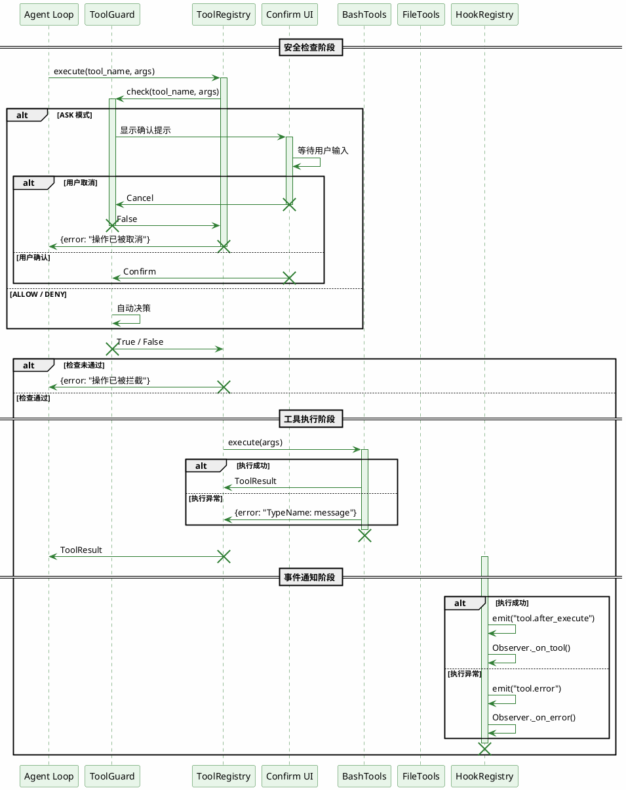

**时序说明：**

| 阶段 | 组件 | 说明 |
|------|------|------|
| 安全检查 | ToolGuard | 规则链匹配，决定放行/拦截/询问 |
| 用户确认 | Confirm UI | ASK 模式下展示确认对话框 |
| 工具执行 | BashTools 等 | 调用具体工具实现 |
| 事件通知 | HookRegistry | 发布 tool.after_execute / tool.error 事件 |

---

## SessionStore (SQLite 持久化)

SQLite 会话存储替代 JSON 文件，支持并发读 + 增量写 + 全文检索。

**表结构：**

```sql
CREATE TABLE sessions (
    id            TEXT PRIMARY KEY,
    title         TEXT DEFAULT '',
    created_at    TEXT NOT NULL,
    updated_at    TEXT NOT NULL,
    message_count INTEGER DEFAULT 0,
    parent_id     TEXT,              -- 支持 Session Fork
    metadata      TEXT DEFAULT '{}'  -- Observer snapshot 存在这
);

CREATE TABLE messages (
    id            INTEGER PRIMARY KEY AUTOINCREMENT,
    session_id    TEXT NOT NULL,
    role          TEXT NOT NULL,
    content       TEXT DEFAULT '',
    tool_call_id  TEXT DEFAULT '',
    tool_calls    TEXT DEFAULT '[]', -- 完整 tool call 链路
    reasoning     TEXT DEFAULT '',
    timestamp     TEXT NOT NULL,
    FOREIGN KEY (session_id) REFERENCES sessions(id)
);

CREATE INDEX idx_msg_session ON messages(session_id, id);
```

**关键设计：**
- **WAL 模式** (`PRAGMA journal_mode=WAL`) — 并发读 + 单写，性能 > 默认 rollback
- **FOREIGN KEY** — 删 session 联动删 messages
- **增量写** — `count_messages` 查 DB 已有 N 条，只写 `messages[N:]`
- **metadata JSON 字段** — Observer snapshot 存这，重启不丢统计
- **parent_id 字段** — 预留 Session Fork

**接入位置**（agent.py 启动装配）：

```python
from merco.memory.session_store import SessionStore
self._session_store = SessionStore(_get_db_path())  # ~/.merco/sessions.db
self.session = Session.resume_or_create(self._session_store)
self._restore_context()  # 从 SQLite 灌入历史消息 + observer.restore()
```

**Session 生命周期：**
1. 启动 → `resume_or_create()` 自动恢复上次会话
2. 每轮 → `session.add_message()` 不立即写盘
3. 循环结束 → `session.save()` 增量写 + `save_metadata(observer.snapshot())`
4. `/new` / 退出 → 合并 live→acc → 持久化

**对比 JSON 文件：**
- 旧：每轮 `json.dump` 全量，1MB 会话 = 1MB IO × N 轮
- 新：增量写 1-2 条消息 = 几十字节 IO

---

## Memory Save Pipeline (Strategy + Pipeline + Hook)

记忆保存侧（"存"和"什么时候存"）采用三模式组合：Strategy 触发 + Pipeline 处理 + Hook 解耦。Recall 链路（HybridRecaller）早已通，本次补齐保存侧实现双向闭环。

**核心结构：**

```python
# 1. Hook 触发（业务代码零感知）
await agent.hooks.emit("command.remember", text="我喜欢用中文", key="user_lang")
await agent.hooks.emit("session.destroy", session_id="s1")

# 2. Strategy 监听事件 → 构造 SaveItem
class ExplicitRememberStrategy(MemorySaveStrategy):
    def subscribe(self, hooks):
        hooks.on("command.remember", self._on_remember)
    async def _on_remember(self, text, key=""):
        await self.pipeline.save(SaveItem(key=key or self._derive_key(text), value=text, source="user"))

# 3. Pipeline 串联 Processor（链式可插拔）
class MemorySavePipeline:
    def __init__(self, store, hooks):
        self._processors = [
            SourceEnricher(),           # 自动加 [user]/[extracted] tag
            DedupProcessor(store),       # 优先级 user>extracted>system，return None=skip
        ]
    async def save(self, item):
        for p in self._processors:
            item = await p.process(item)        # None = skip
            if item is None:
                return False
        self.store.save(item.key, item.value, tags=item.tags)
        await self.hooks.emit("memory.saved", key=item.key, ...)
        return True
```

**三个关键设计：**

1. **Source 优先级保护**：`SOURCE_PRIORITY = {user: 3, extracted: 2, system: 1}`，user 显式存的永远不被 extracted（LLM 自动抽）覆盖。`DedupProcessor._infer_source` 从已有 tag 反推优先级，对抗自动抽取污染。

2. **fail-soft 抽取**：`SessionEndExtractStrategy` 在 LLM 调用/JSON 解析失败时 log warning 并 return，永不阻塞 `session.destroy` 流程。LLM 失败不应影响用户退出体验。

3. **Hook 双向解耦**：业务代码只 emit 事件，Strategy 监听 + 写库 + emit `memory.saved` + Observer 计数。CLI `/remember`/Strategy/Observer/未来的 Audit 全部订阅同一事件流，加新订阅者零侵入。

**对比直接调用：**
- 旧：业务代码 `store.save(...)` 散落各处，新增触发源要改所有调用点
- 新：业务只 emit，Strategy 抽象让新触发源（webhook/scheduler/MCP）扩展只需一个类

**接入位置**（agent.py 启动装配）：

```python
self._memory_store = MemoryStore(config.memory_path)
self.memory_save_pipeline = MemorySavePipeline(store=self._memory_store, hooks=self.hooks)
self.memory_strategies = [ExplicitRememberStrategy(self.memory_save_pipeline)]
if config.memory_auto_extract_on_session_end:
    self.memory_strategies.append(SessionEndExtractStrategy(
        self.memory_save_pipeline, self.llm,
        session_store=self._session_store,
        max_per_session=config.memory_extract_max_per_session,
        min_messages=config.memory_extract_min_messages,
    ))
for strat in self.memory_strategies:
    strat.subscribe(self.hooks)
```

**YAGNI 预留扩展点**（不实现）：

- `SecretFilterProcessor` — 检测 API key/密码/身份证号
- TTL 过期机制
- MemoryStore backend 抽象（SQLite 后端）
- 跨 agent 共享 Memory

---

## Sandbox 扩展路线（从规则守卫到容器隔离）

当前 `ToolGuard` 不是真正的沙箱——它只是**规则匹配 + 用户确认**，无法提供进程级隔离。

**现状：**

| 文件 | 状态 |
|------|------|
| `guard.py` | ✅ ToolGuard 规则守卫（已接通 Tools） |
| `security.py` | ✅ SecurityChecker 正则检测 |
| `confirm.py` | ✅ 确认 UI |
| `snapshot.py` | ✅ 快照（中断恢复用） |

**已删除：**
- `sandbox/isolation.py` — 已删除
- `sandbox/permissions.py` — 已删除

**扩展路线：**

#### 阶段 1: 本地增强（轻量）

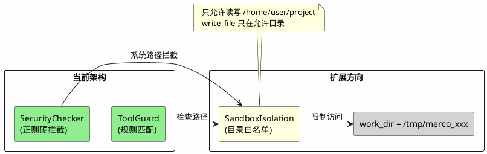

实现：在 `ToolRegistry.execute()` 调目录检查。

#### 阶段 2: 进程级隔离

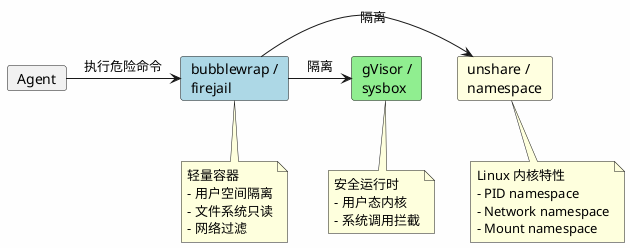

用 subprocess 调 bubblewrap 包装 bash 执行。

#### 阶段 3: Docker 容器（本地/远程）

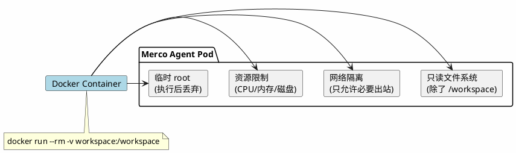

#### 阶段 4: 云上容器

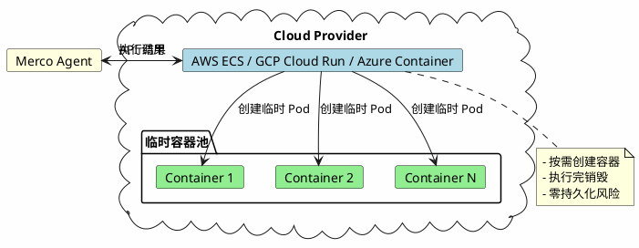

对接 AWS/GCP 的容器服务 API，创建临时容器执行工具。

**扩展点汇总：**

| 扩展 | 实现方式 | 难度 |
|------|----------|------|
| 接上 SandboxIsolation | 在 ToolRegistry.execute() 调目录检查 | ⭐ |
| bubblewrap 封装 | 用 subprocess 调 bubblewrap 包装 bash 执行 | ⭐⭐ |
| Docker 容器 | 用 `docker run --rm -v workspace:/workspace` | ⭐⭐ |
| 远程 Docker API | 对接 cloud provider API 创建临时容器 | ⭐⭐⭐ |
| Kubernetes Pod | 临时 Pod + exec 到容器内执行 | ⭐⭐⭐ |