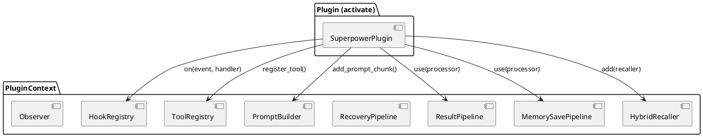
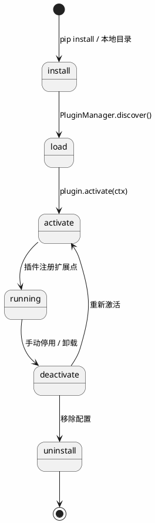
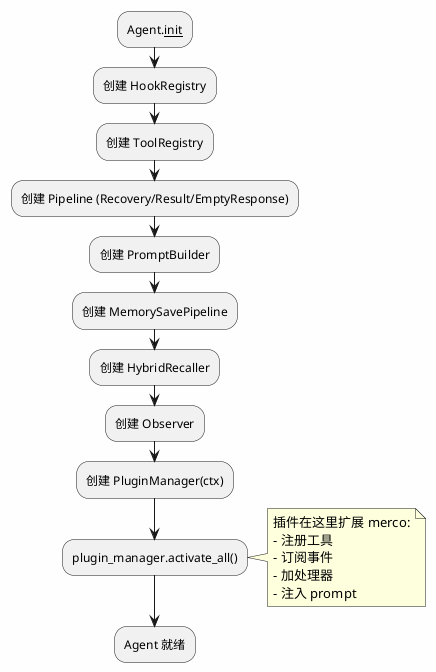

# merco 插件系统设计

> 最后更新: 2026-06-20

## 目标

构建 merco 的插件系统，让插件成为 merco 架构的一等公民。插件可以影响 merco 的任何方面（工具、事件、管线、记忆、prompt），并通过 Observer 追踪插件事件。

**核心理念：插件不是在 merco 上面套一层，而是插件就是 merco 架构的一部分。**

## 现状

merco 已有 6 个天然扩展点：

| 扩展点 | 位置 | 用途 |
|--------|------|------|
| `Pipeline.use(processor)` | `merco/core/pipeline.py` | 结果/恢复/空回复/记忆保存管线 |
| `HookRegistry.on(event, handler)` | `merco/hooks/registry.py` | 事件订阅 |
| `PromptBuilder.use(chunk)` | `merco/core/agent.py` | system prompt 注入 |
| `HybridRecaller.add(recaller)` | `merco/memory/recall.py` | 记忆召回链 |
| `ToolRegistry.register(tool)` | `merco/tools/registry.py` | 工具注册 |
| `MemorySaveStrategy.subscribe(hooks)` | `merco/memory/strategy.py` | 保存策略 |

**空缺**：没有统一的插件定义、生命周期管理、发现机制。

## 架构总览



## 插件生命周期



## Agent 启动流程



## 插件定义

### Plugin 基类

```python
from abc import ABC, abstractmethod


class Plugin(ABC):
    """merco 插件基类"""
    name: str           # 唯一标识
    version: str        # 语义版本
    description: str    # 一句话描述

    @abstractmethod
    async def activate(self, ctx: "PluginContext") -> None:
        """激活时调用，ctx 提供所有扩展点"""
        ...

    async def deactivate(self) -> None:
        """卸载时调用，清理资源。默认空实现"""
        pass
```

### PluginContext — 扩展点访问器

```python
class PluginContext:
    """插件的扩展点入口，activate 时注入"""
    hooks: HookRegistry
    tool_registry: ToolRegistry
    prompt_builder: PromptBuilder
    recovery_pipeline: RecoveryPipeline
    result_pipeline: ResultPipeline
    memory_save_pipeline: MemorySavePipeline
    recaller: HybridRecaller
    config: MercoConfig
    observer: Observer

    def on(self, event: str, handler: Callable) -> None:
        """订阅事件（便捷方法）"""
        self.hooks.on(event, handler)

    def register_tool(self, tool: BaseTool) -> None:
        """注册工具"""
        self.tool_registry.register(tool)

    def add_prompt_chunk(self, chunk: PromptChunk) -> None:
        """注入 system prompt chunk"""
        self.prompt_builder.use(chunk)

    def add_processor(self, pipeline_name: str, processor) -> None:
        """加处理器到指定管线"""
        pipeline = getattr(self, pipeline_name, None)
        if pipeline and hasattr(pipeline, 'use'):
            pipeline.use(processor)

    def add_recaller(self, recaller: BaseRecaller) -> None:
        """加记忆召回器"""
        self.recaller.add(recaller)
```

## PluginManager — 发现、加载、激活、卸载

```python
class PluginManager:
    def __init__(self, ctx: PluginContext):
        self._ctx = ctx
        self._plugins: dict[str, Plugin] = {}      # name → instance
        self._active: set[str] = set()             # 已激活的插件名

    async def discover(self) -> list[str]:
        """扫描 ~/.merco/plugins/ + pip 包，返回可用插件名列表"""
        ...

    async def install(self, source: str) -> None:
        """安装插件：本地路径 或 pip 包名"""
        ...

    async def uninstall(self, name: str) -> None:
        """卸载插件：deactivate + 移除"""
        ...

    async def activate(self, name: str) -> None:
        """激活单个插件"""
        plugin = self._load(name)
        await plugin.activate(self._ctx)
        self._active.add(name)
        await self._ctx.hooks.emit("plugin.activated", plugin_name=name, version=plugin.version)

    async def deactivate(self, name: str) -> None:
        """停用单个插件"""
        await self._plugins[name].deactivate()
        self._active.discard(name)
        await self._ctx.hooks.emit("plugin.deactivated", plugin_name=name)

    async def activate_all(self) -> None:
        """启动时激活所有 enabled 插件"""
        for name in self._ctx.config.plugins:
            if self._ctx.config.plugins[name].get("enabled", True):
                try:
                    await self.activate(name)
                except Exception as e:
                    logger.warning("插件 '%s' 激活失败: %s", name, e)
                    await self._ctx.hooks.emit("plugin.error", plugin_name=name, error=str(e))
```

### 插件发现

```
~/.merco/plugins/           # 用户插件目录（.py 文件）
merco/plugins/builtin/      # 内置插件（随 wheel 分发）
pip install merco-plugin-x  # 包管理器安装（入口点 merco.plugins）
```

### merco.json 配置

```json
{
  "plugins": {
    "superpower": { "enabled": true },
    "security-scanner": { "enabled": false }
  }
}
```

## Observer 集成

### 插件事件

| 事件 | 触发方 | 载荷 |
|------|--------|------|
| `plugin.activated` | PluginManager.activate | plugin_name, version |
| `plugin.deactivated` | PluginManager.deactivate | plugin_name |
| `plugin.error` | PluginManager.activate_all | plugin_name, error |

### Observer 订阅

```python
hooks.on("plugin.activated", self._on_plugin_activated)
hooks.on("plugin.error", self._on_plugin_error)

def _on_plugin_activated(self, plugin_name: str = "", **kwargs):
    self._live.increment(f"plugin.{plugin_name}.activations")
```

### /report 输出扩展

```
📊 观察性报告
────────────────
plugins:
  superpower: activated 1x, tools_registered 3, hooks_registered 2
  security-scanner: activated 1x, pipeline_processors 1
```

## 示例插件：Superpower

```python
class SuperpowerPlugin(Plugin):
    name = "superpower"
    version = "1.0.0"
    description = "扩展 merco 的超能力：TDD、debugging、subagent、code review 等"

    async def activate(self, ctx: PluginContext):
        # 1. 注册工具
        ctx.register_tool(TDDTool())
        ctx.register_tool(DebugTool())
        ctx.register_tool(CodeReviewTool())

        # 2. 注册 prompt chunk
        ctx.add_prompt_chunk(SuperpowerHintChunk())

        # 3. 订阅事件
        ctx.hooks.on("agent.start", self._on_start)
        ctx.hooks.on("tool.error", self._on_tool_error)

        # 4. 加处理器到管线
        ctx.result_pipeline.use(SuperpowerResultProcessor())

        # 5. 加 recall 策略
        ctx.recaller.add(SuperpowerRecaller())

    async def deactivate(self):
        # 清理（如果需要）
        pass
```

## 失败隔离

| 场景 | 处理 | 用户感知 |
|------|------|---------|
| activate 失败 | log + skip + emit plugin.error | 插件未激活，其他插件正常 |
| deactivate 失败 | log + 强制移除 | 插件已移除 |
| 插件内部异常 | try/catch 包裹 | 不影响其他插件 |
| 插件循环依赖 | 激活顺序按 config 声明 | 无自动检测 |

## YAGNI 边界（不做）

- ❌ 插件依赖声明（插件 A 依赖插件 B）
- ❌ 插件版本冲突检测
- ❌ 插件沙箱隔离（Python import 无法真正隔离）
- ❌ 插件市场/远程仓库
- ❌ 插件热重载（重启生效）

## 文件结构

```
merco/
├── plugins/
│   ├── __init__.py
│   ├── base.py              # Plugin ABC + PluginContext
│   ├── manager.py           # PluginManager
│   └── builtin/
│       ├── __init__.py
│       └── superpower/
│           ├── __init__.py
│           └── plugin.py    # SuperpowerPlugin
├── core/
│   └── agent.py             # 启动时调用 plugin_manager.activate_all()
└── merco.json               # plugins 配置

tests/
└── plugins/
    ├── test_plugin_base.py
    ├── test_plugin_manager.py
    └── test_superpower.py
```

## 测试计划

| 层 | 文件 | 用例 |
|---|------|------|
| Unit | `tests/plugins/test_plugin_base.py` | Plugin 基类、PluginContext 扩展点 |
| Unit | `tests/plugins/test_plugin_manager.py` | 发现/加载/激活/卸载/失败隔离 |
| Unit | `tests/plugins/test_superpower.py` | Superpower 插件注册工具/事件/管线 |
| Integration | `tests/plugins/test_plugin_integration.py` | 插件激活后 Agent 运行端到端 |

## 与 opencode 插件系统的对比

| 维度 | Opencode | Merco |
|------|----------|-------|
| 插件定义 | 函数返回 Hooks 对象 | 类继承 Plugin，activate 注册扩展点 |
| 扩展方式 | 20+ 个 hook 插槽 | 6 个扩展点 + 事件系统 |
| 管线扩展 | 无 | Pipeline.use(processor) |
| 记忆感知 | 无 | PluginContext.recaller/memory_save_pipeline |
| 观察性 | 无 | PluginContext.observer |
| 隔离 | 异常捕获 | ToolGuard + Observer 追踪 |
| 语言 | TypeScript | Python |

## merco 插件系统的独特价值

1. **插件即架构** — 不是套一层，是融入现有 Pipeline/Hook/Tool/Recaller
2. **Pipeline 扩展** — 插件可以加处理器到任何管线（opencode 做不到）
3. **记忆感知** — 插件可以读写记忆，实现跨 session 状态
4. **Observer 追踪** — 插件的每次调用都有可观测性
5. **ToolGuard 集成** — 插件注册的工具受安全守卫保护
