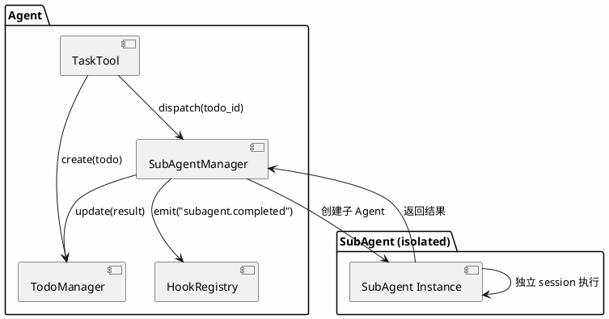
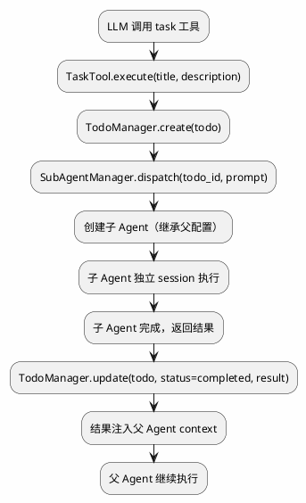
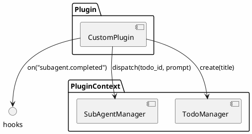
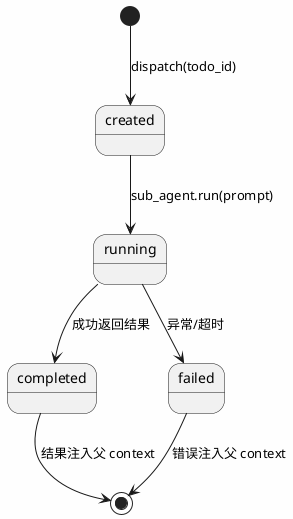

# merco Todo + SubAgent 系统设计

> 最后更新: 2026-06-20

## 目标

构建 merco 的 Todo 管理 + 子代理派发系统，作为 merco 的原子特性。Todo 驱动子代理执行，子代理完成后结果自动注入父代理 context。

**核心理念：Todo 是任务的抽象，SubAgent 是执行的载体，两者结合实现任务分解与并行执行。**

## 现状

- `merco/tools/task_tools.py` — TaskTool 骨架（`check()` 返回 False，隐藏）
- 无 Todo 管理系统
- 无子代理派发能力

## 架构总览



## Todo 驱动子代理流程



## 插件扩展



## TodoManager — 任务列表管理

### 数据模型

```python
from dataclasses import dataclass, field


@dataclass
class TodoItem:
    """任务项"""
    id: str              # 唯一 ID
    title: str           # 任务标题
    description: str     # 详细描述
    status: str          # pending / in_progress / completed / failed
    priority: int        # 0=低 1=中 2=高
    parent_id: str       # 父任务 ID（支持子任务）
    assigned_to: str     # 分配给哪个子代理
    created_at: str
    updated_at: str
    result: str          # 子代理执行结果
```

### SQLite 表

```sql
CREATE TABLE todos (
    id TEXT PRIMARY KEY,
    title TEXT NOT NULL,
    description TEXT DEFAULT '',
    status TEXT DEFAULT 'pending',
    priority INTEGER DEFAULT 1,
    parent_id TEXT,
    assigned_to TEXT,
    created_at TEXT NOT NULL,
    updated_at TEXT NOT NULL,
    result TEXT DEFAULT ''
);
```

### API

```python
class TodoManager:
    """Todo 任务管理器"""

    def __init__(self, db_path: str):
        ...

    def create(self, title: str, description: str = "", priority: int = 1, parent_id: str = None) -> TodoItem:
        """创建任务"""
        ...

    def update(self, id: str, **kwargs) -> TodoItem:
        """更新任务"""
        ...

    def get(self, id: str) -> TodoItem:
        """获取任务"""
        ...

    def list(self, status: str = None, parent_id: str = None) -> list[TodoItem]:
        """列出任务（可按 status/parent_id 过滤）"""
        ...

    def delete(self, id: str) -> None:
        """删除任务"""
        ...
```

## SubAgentManager — 子代理派发

### 核心概念

子代理 = 新的 Agent 实例，继承父代理的 tools/config/memory，但有独立 session。

### 继承与隔离

| 继承 | 隔离 |
|------|------|
| tools (ToolRegistry) | session (独立) |
| config (MercoConfig) | context (独立) |
| memory (MemoryStore) | observer (独立计数) |
| plugins (PluginManager) | |

### API

```python
class SubAgentManager:
    """子代理派发管理器"""

    def __init__(self, parent_agent: "Agent"):
        self._parent = parent_agent
        self._active: dict[str, "Agent"] = {}  # subagent_id → Agent

    async def dispatch(self, todo_id: str, prompt: str, agent_name: str = "default") -> str:
        """派发子代理执行任务，返回 subagent_id"""
        # 1. 创建子 Agent（继承父的 tools/config/memory）
        sub_agent = self._create_sub_agent(agent_name)

        # 2. 更新 Todo 状态
        self._parent.todo_manager.update(todo_id, status="in_progress", assigned_to=sub_agent.session.id)

        # 3. 执行子代理
        result = await sub_agent.run(prompt)

        # 4. 更新 Todo 结果
        self._parent.todo_manager.update(todo_id, status="completed", result=result)

        # 5. 结果注入父 context
        self._inject_result_to_parent(todo_id, result)

        return sub_agent.session.id

    def _create_sub_agent(self, agent_name: str) -> "Agent":
        """创建子 Agent，继承父的配置"""
        # 复制父的 config/tools/memory/plugins
        # 创建新的 session（隔离）
        ...

    def _inject_result_to_parent(self, todo_id: str, result: str):
        """把子代理结果注入父代理的 context"""
        # 添加一条 system/tool 消息到父的 context
        ...
```

### 子代理生命周期



## TaskTool — LLM 面向工具

### 激活

```python
class TaskTool(BaseTool):
    """委派任务给子代理"""

    name = "task"
    description = "创建任务并派发给子代理执行"
    toolset = "task"

    def check(self) -> bool:
        return True  # 激活！

    async def execute(self, title: str, description: str = "", priority: int = 1, agent: str = "default") -> dict:
        # 1. 创建 Todo
        todo = self._todo_manager.create(title, description, priority)

        # 2. 派发子代理
        subagent_id = await self._sub_agent_manager.dispatch(todo.id, description, agent)

        return {
            "todo_id": todo.id,
            "subagent_id": subagent_id,
            "status": "dispatched",
        }
```

### LLM 使用示例

```
User: 帮我重构这个模块，同时写测试

LLM: 我来分解任务：
1. 调用 task 工具创建"重构模块"任务
2. 调用 task 工具创建"写测试"任务
3. 两个子代理并行执行
4. 结果自动返回，我继续整合
```

## CLI 命令

| 命令 | 行为 |
|------|------|
| `/todos` | 列出所有 Todo（支持 status 过滤） |
| `/todo <id>` | 查看单个 Todo 详情 |
| `/todo-done <id>` | 标记完成 |

## Hook 事件

| 事件 | 触发方 | 载荷 |
|------|--------|------|
| `todo.created` | TodoManager.create | todo_id, title |
| `todo.updated` | TodoManager.update | todo_id, status |
| `todo.completed` | TodoManager.update | todo_id, result |
| `subagent.dispatched` | SubAgentManager.dispatch | todo_id, subagent_id |
| `subagent.completed` | SubAgentManager.dispatch | todo_id, result |
| `subagent.failed` | SubAgentManager.dispatch | todo_id, error |

## PluginContext 扩展

```python
class PluginContext:
    # 已有
    hooks: HookRegistry
    tool_registry: ToolRegistry
    ...

    # 新增
    todo_manager: TodoManager
    sub_agent_manager: SubAgentManager
```

插件可以：
- `ctx.todo_manager.create(title)` — 创建任务
- `ctx.sub_agent_manager.dispatch(todo_id, prompt)` — 派发子代理
- `ctx.hooks.on("subagent.completed", handler)` — 监听子代理完成

## 失败处理

| 场景 | 处理 | 用户感知 |
|------|------|---------|
| 子代理执行异常 | Todo 标记 failed + 错误注入父 context | 父 Agent 看到错误，决定是否重试 |
| 子代理超时 | Todo 标记 failed + 超时提示 | 父 Agent 看到超时，决定是否重试 |
| Todo 创建失败 | 返回错误给 LLM | LLM 看到错误，决定是否重试 |
| 子代理创建失败 | Todo 保持 pending + 错误日志 | 父 Agent 继续执行 |

## YAGNI 边界（不做）

- ❌ 子代理并行执行（先串行，后续再加）
- ❌ 子代理深度限制（先不限制）
- ❌ 子代理间通信（只通过父代理）
- ❌ Todo 优先级排序算法（先简单列表）
- ❌ Todo 过期/超时机制（先手动管理）

## 文件结构

```
merco/
├── todo/
│   ├── __init__.py
│   ├── manager.py          # TodoManager
│   └── models.py           # TodoItem dataclass
├── agents/
│   ├── __init__.py
│   └── subagent.py         # SubAgentManager
├── tools/
│   └── task_tools.py       # TaskTool（激活）
├── plugins/
│   └── base.py             # PluginContext 新增 todo_manager/sub_agent_manager
├── core/
│   └── agent.py            # 装配 TodoManager + SubAgentManager
└── cli/
    └── commands.py          # /todos /todo /todo-done

tests/
├── todo/
│   ├── test_manager.py
│   └── test_models.py
├── agents/
│   └── test_subagent.py
└── integration/
    └── test_todo_subagent.py
```

## 测试计划

| 层 | 文件 | 用例 |
|---|------|------|
| Unit | `tests/todo/test_manager.py` | Todo CRUD、状态更新、过滤 |
| Unit | `tests/todo/test_models.py` | TodoItem dataclass |
| Unit | `tests/agents/test_subagent.py` | SubAgent 创建、继承、隔离 |
| Integration | `tests/integration/test_todo_subagent.py` | Todo → dispatch → execute → result 注入 |

## 与 opencode/OmO 的对比

| 维度 | Opencode/OmO | Merco |
|------|-------------|-------|
| Todo 管理 | 无 | SQLite TodoManager |
| 子代理派发 | delegate_task (OmO) | SubAgentManager + TaskTool |
| 结果回传 | 手动聚合 | 自动注入父 context |
| 插件扩展 | 无 | PluginContext 暴露 TodoManager + SubAgentManager |
| 任务驱动 | 无 | Todo 驱动子代理执行 |

## merco Todo + SubAgent 的独特价值

1. **Todo 驱动** — 不是简单的子代理派发，而是任务分解 + 状态追踪
2. **自动结果注入** — 子代理结果自动回传父 context，无需手动聚合
3. **插件扩展** — 插件可以创建任务、派发子代理、监听完成事件
4. **SQLite 持久化** — Todo 持久化，重启不丢失
5. **Hook 集成** — todo.created/subagent.completed 等事件可被 Observer 追踪
