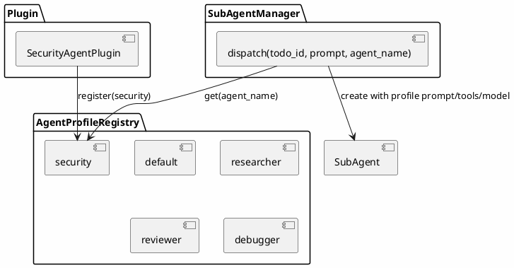
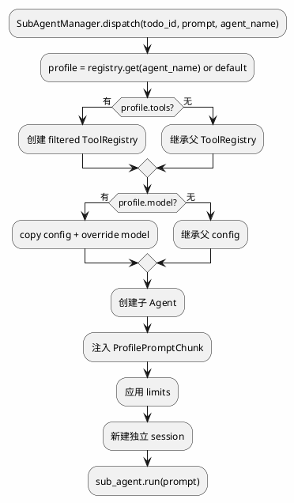

# merco AgentProfile 插件化设计

> 最后更新: 2026-06-26

## 目标

构建 merco 的 AgentProfile 插件化系统，让子代理不再只是 `default`，而是可以按专业角色（researcher/reviewer/debugger/security 等）创建。插件可以注册新的 AgentProfile，SubAgentManager 根据 `agent_name` 使用对应 profile 创建专业子代理。

**核心理念：SubAgentManager 是派发内核，AgentProfile 是可拔插的专业角色。**

## 现状

- `SubAgentManager.dispatch(todo_id, prompt, agent_name="default")` 已有 `agent_name` 参数
- `_create_sub_agent(agent_name)` 当前忽略 `agent_name`，只创建普通子代理
- PluginContext 暴露 `sub_agent_manager` / `todo_manager`，但没有 `agent_profiles`

## 架构总览



## 子代理创建流程



## AgentProfile 数据模型

```python
from dataclasses import dataclass, field


@dataclass
class AgentProfile:
    """子代理专业角色配置"""
    name: str                    # researcher / reviewer / debugger
    description: str             # 什么时候使用
    prompt: str                  # 子代理专属 system prompt
    tools: list[str] = field(default_factory=list)   # 工具 allowlist，空=继承全部
    model: dict | None = None    # {"provider": "...", "model": "..."} 可选
    limits: dict = field(default_factory=dict)       # {"max_tool_calls": 20}
```

### 字段说明

| 字段 | 用途 |
|------|------|
| `name` | 唯一标识，TaskTool 的 `agent` 参数用这个 |
| `description` | 给 LLM / CLI 看，说明什么时候使用 |
| `prompt` | 子代理专属 system prompt |
| `tools` | 工具 allowlist，空列表表示继承全部工具 |
| `model` | 可选模型覆盖（provider/model） |
| `limits` | 可选运行限制（max_tool_calls 等） |

## AgentProfileRegistry

```python
class AgentProfileRegistry:
    """AgentProfile 注册表"""

    def __init__(self):
        self._profiles: dict[str, AgentProfile] = {}

    def register(self, profile: AgentProfile) -> None:
        self._profiles[profile.name] = profile

    def get(self, name: str) -> AgentProfile | None:
        return self._profiles.get(name)

    def list(self) -> list[AgentProfile]:
        return list(self._profiles.values())
```

## 内置 Profiles

### default

```python
AgentProfile(
    name="default",
    description="普通子代理，继承父代理全部能力",
    prompt="你是 merco 子代理。完成父代理委派的任务，返回简洁明确的结果。",
)
```

### researcher

```python
AgentProfile(
    name="researcher",
    description="代码搜索、资料收集、架构理解",
    prompt="你是代码研究员。专注于阅读代码、搜索资料、归纳结构，不做大规模修改。输出清晰的发现和证据。",
    tools=["read_file", "web_fetch", "web_search"],
    limits={"max_tool_calls": 30},
)
```

### reviewer

```python
AgentProfile(
    name="reviewer",
    description="代码审查、bug 风险识别、质量检查",
    prompt="你是代码审查专家。专注于发现 correctness bug、边界条件、测试缺口和架构问题。只报告高置信问题。",
    tools=["read_file", "grep", "bash"],
    limits={"max_tool_calls": 25},
)
```

### debugger

```python
AgentProfile(
    name="debugger",
    description="系统调试、根因分析、失败复现",
    prompt="你是系统调试专家。先定位症状，再建立假设，最后用测试/日志验证。不要盲改。",
    tools=["read_file", "bash", "grep"],
    limits={"max_tool_calls": 40},
)
```

## SubAgentManager 集成

### 核心变化

```python
class SubAgentManager:
    def __init__(self, parent, profile_registry):
        self._parent = parent
        self._profiles = profile_registry

    def _create_sub_agent(self, agent_name: str) -> Agent:
        profile = self._profiles.get(agent_name) or self._profiles.get("default")

        sub_agent = Agent(
            config=self._apply_model_override(profile),
            tool_registry=self._filter_tools(profile.tools),
        )

        # 注入 profile prompt
        sub_agent.prompt_builder.use(ProfilePromptChunk(profile))

        # 应用 limits
        if profile.limits.get("max_tool_calls"):
            sub_agent.config.max_tool_calls = profile.limits["max_tool_calls"]

        return sub_agent
```

### ProfilePromptChunk

```python
class ProfilePromptChunk(PromptChunk):
    name = "agent_profile"

    def __init__(self, profile: AgentProfile):
        self.profile = profile

    def build(self, agent):
        return f"## Agent Role: {self.profile.name}\n{self.profile.prompt}"
```

### 工具 allowlist

- 如果 `profile.tools == []` → 继承父代理全部工具
- 否则创建新的 `ToolRegistry`，只注册 allowlist 中的工具

### model override

- 如果 `profile.model` 有值 → copy config，覆盖 provider/model
- 否则继承父 config

### limits

- `limits.max_tool_calls` → 覆盖子代理 config.max_tool_calls
- 后续可扩展 max_tokens / timeout 等

## PluginContext 扩展

```python
class PluginContext:
    # 已有
    hooks: HookRegistry
    tool_registry: ToolRegistry
    todo_manager: TodoManager
    sub_agent_manager: SubAgentManager
    ...

    # 新增
    agent_profiles: AgentProfileRegistry
```

## 插件注册 Profile 示例

```python
class SecurityAgentPlugin(Plugin):
    async def activate(self, ctx):
        ctx.agent_profiles.register(AgentProfile(
            name="security",
            description="安全审计与漏洞分析",
            prompt="你是安全审计专家，专注于漏洞、权限、输入验证、敏感信息泄露。",
            tools=["read_file", "grep", "bash"],
            limits={"max_tool_calls": 30},
        ))
```

## TaskTool 使用

```python
# LLM 调用
await task(
    title="审查认证模块",
    description="找安全问题",
    agent="security",
)

# TaskTool → SubAgentManager.dispatch(todo_id, prompt, agent_name="security")
```

## CLI 命令

| 命令 | 行为 |
|------|------|
| `/agents` | 列出所有 AgentProfile |
| `/agent <name>` | 查看 profile 详情 |

## Hook 事件

| 事件 | 触发方 | 载荷 |
|------|--------|------|
| `agent_profile.registered` | AgentProfileRegistry.register | profile_name, description |
| `subagent.dispatched` | SubAgentManager.dispatch | todo_id, subagent_id, agent_name |
| `subagent.completed` | SubAgentManager.dispatch | todo_id, result, agent_name |

## 文件结构

```
merco/
├── agents/
│   ├── profile.py          # AgentProfile dataclass + AgentProfileRegistry + builtins
│   └── subagent.py         # 使用 profile 创建子代理
├── plugins/
│   └── base.py             # PluginContext 新增 agent_profiles
├── core/
│   └── agent.py            # 创建 AgentProfileRegistry，注册 builtins
└── cli/
    └── commands.py         # /agents /agent

tests/
├── agents/
│   ├── test_profile.py
│   └── test_subagent_profile.py
└── integration/
    └── test_agent_profile.py
```

## 测试计划

| 层 | 文件 | 用例 |
|---|------|------|
| Unit | `tests/agents/test_profile.py` | AgentProfile dataclass + Registry CRUD + builtins |
| Unit | `tests/agents/test_subagent_profile.py` | SubAgentManager 使用 profile 创建子代理 |
| Integration | `tests/integration/test_agent_profile.py` | TaskTool agent=researcher 端到端 |

## YAGNI 边界（不做）

- ❌ profile 持久化（先运行时注册）
- ❌ profile 依赖/继承关系
- ❌ profile 热加载
- ❌ profile marketplace
- ❌ profile 自动选择（LLM 自选后续再做）

## 与现有系统的关系

| 现有 | 改动 |
|------|------|
| `SubAgentManager` | 根据 agent_name 查 AgentProfile |
| `TaskTool` | 已有 agent 参数，直接生效 |
| `PluginContext` | 新增 agent_profiles |
| `PluginManager` | 插件 activate 时可注册 profile |
| `TodoManager` | 不改 |

## merco AgentProfile 的独特价值

1. **多 Agent 原子抽象** — 专业子代理不再是硬编码，而是 profile
2. **插件可注册专业角色** — security/researcher/frontend 等都能作为插件提供
3. **与 Todo + SubAgent 无缝结合** — task(agent="researcher") 直接派发专业代理
4. **与 Memory 后续可组合** — profile 可绑定专属记忆，演化成 Memory-Native Multi-Agent
5. **工程可控** — 运行时注册，不引入持久化复杂度
