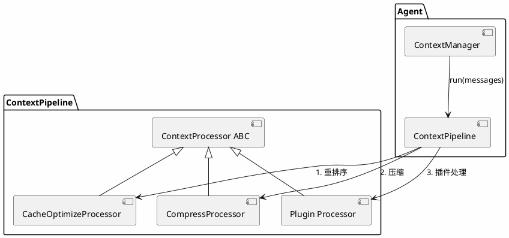
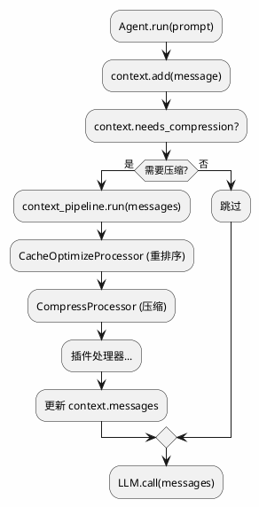

# merco Context Pipeline 系统设计

> 最后更新: 2026-06-26

## 目标

构建 merco 的 Context Pipeline 系统，让上下文处理（压缩、缓存优化、语义分组等）成为可扩展的管线。插件可以注册自定义处理器，影响 LLM 收到的上下文结构。

**核心理念：上下文处理不是硬编码逻辑，而是可组合的处理器链。**

## 现状

- `ContextManager` (`merco/core/context.py`) — 简单数据结构（消息列表 + token 计数）
- `ContextCompressor` (`merco/memory/compressor.py`) — 硬编码 "sliding" / "truncate" 两种策略
- `Agent._compress_context` (`merco/core/agent.py`) — 直接调用 ContextCompressor，不可扩展

**空缺**：没有统一的上下文处理管线，插件无法影响上下文结构。

## 架构总览



## 处理流程



## ContextProcessor + ContextPipeline

### ContextProcessor 基类

```python
from abc import ABC, abstractmethod


class ContextProcessor(ABC):
    """上下文处理器基类"""
    name: str = ""

    @abstractmethod
    async def process(self, messages: list[dict], **kwargs) -> list[dict]:
        """处理消息列表，返回处理后的消息列表"""
        ...
```

### ContextPipeline

```python
class ContextPipeline:
    """上下文处理管线 — 按注册顺序执行处理器"""

    def __init__(self):
        self._processors: list[ContextProcessor] = []

    def use(self, processor: ContextProcessor) -> "ContextPipeline":
        """注册处理器"""
        self._processors.append(processor)
        return self

    async def run(self, messages: list[dict], **kwargs) -> list[dict]:
        """按顺序执行所有处理器"""
        for p in self._processors:
            messages = await p.process(messages, **kwargs)
        return messages
```

**可配置顺序：** 插件通过 `ctx.context_pipeline.use(processor)` 注册，顺序即注册顺序。

## 内置处理器

### CompressProcessor — 替代现有 ContextCompressor

```python
class CompressProcessor(ContextProcessor):
    """压缩：超过阈值时摘要旧消息"""
    name = "compress"

    def __init__(self, max_tokens: int = 64000, threshold: float = 0.75):
        self.max_tokens = max_tokens
        self.threshold = threshold

    async def process(self, messages: list[dict], **kwargs) -> list[dict]:
        total = sum(msg_tokens(m) for m in messages)
        trigger = int(self.max_tokens * self.threshold)
        if total <= trigger or len(messages) <= 4:
            return messages

        strategy = kwargs.get("compress_strategy", "sliding")
        summary_fn = kwargs.get("summary_fn")

        if strategy == "sliding":
            return await self._sliding(messages, summary_fn)
        elif strategy == "truncate":
            return self._truncate(messages)
        return messages
```

**迁移现有逻辑：** `ContextCompressor._sliding()` 和 `ContextCompressor._truncate()` 迁移到 `CompressProcessor`。

### CacheOptimizeProcessor — 提高缓存命中率

```python
class CacheOptimizeProcessor(ContextProcessor):
    """缓存优化：重排序让稳定内容在前"""
    name = "cache_optimize"

    async def process(self, messages: list[dict], **kwargs) -> list[dict]:
        stable = []
        volatile = []

        for msg in messages:
            if self._is_stable(msg):
                stable.append(msg)
            else:
                volatile.append(msg)

        return stable + volatile

    def _is_stable(self, msg: dict) -> bool:
        """判断消息是否稳定（可缓存）"""
        role = msg.get("role", "")
        if role == "system":
            return True
        content = str(msg.get("content", ""))
        if "[Earlier conversation summary]" in content:
            return True
        if "[memory]" in content:
            return True
        return False
```

## PluginContext 扩展

```python
class PluginContext:
    # 已有
    hooks: HookRegistry
    tool_registry: ToolRegistry
    ...

    # 新增
    context_pipeline: ContextPipeline
```

**插件扩展示例：**

```python
class SmartContextPlugin(Plugin):
    async def activate(self, ctx):
        # 注册自定义压缩策略
        ctx.context_pipeline.use(SmartCompressProcessor())
        # 或注册缓存优化器
        ctx.context_pipeline.use(CacheOptimizeProcessor())
```

## Agent 集成

### 装配

```python
# Agent.__init__
from merco.context.pipeline import ContextPipeline
from merco.context.processors.compress import CompressProcessor
from merco.context.processors.cache_optimize import CacheOptimizeProcessor

self.context_pipeline = ContextPipeline()
self.context_pipeline.use(CacheOptimizeProcessor())
self.context_pipeline.use(CompressProcessor(
    max_tokens=config.max_input_tokens,
    threshold=config.compression_threshold,
))

# PluginContext
self._plugin_ctx.context_pipeline = self.context_pipeline
```

### 替换 _compress_context

```python
# Agent._compress_context 改为
async def _compress_context(self):
    messages = await self.context_pipeline.run(
        self.context.messages,
        summary_fn=self._llm_summary,
        compress_strategy="sliding",
    )
    self.context.messages = messages
```

## 文件结构

```
merco/
├── context/
│   ├── __init__.py
│   ├── pipeline.py           # ContextProcessor ABC + ContextPipeline
│   └── processors/
│       ├── __init__.py
│       ├── compress.py       # CompressProcessor
│       └── cache_optimize.py # CacheOptimizeProcessor
├── plugins/
│   └── base.py               # PluginContext 新增 context_pipeline
├── core/
│   ├── agent.py              # 装配 ContextPipeline，替换 _compress_context
│   └── context.py            # ContextManager（不改）
└── memory/
    └── compressor.py         # 废弃（逻辑迁移到 CompressProcessor）

tests/
├── context/
│   ├── test_pipeline.py
│   └── test_processors.py
└── integration/
    └── test_context_pipeline.py
```

## 测试计划

| 层 | 文件 | 用例 |
|---|------|------|
| Unit | `tests/context/test_pipeline.py` | Pipeline 注册/执行/顺序 |
| Unit | `tests/context/test_processors.py` | CompressProcessor + CacheOptimizeProcessor |
| Integration | `tests/integration/test_context_pipeline.py` | Agent 端到端压缩流程 |

## YAGNI 边界（不做）

- ❌ 语义分组处理器（先不实现）
- ❌ 过滤处理器（先不实现）
- ❌ 处理器优先级（先按注册顺序）
- ❌ 处理器条件执行（先全量执行）
- ❌ 处理器并行执行（先串行）

## 与现有系统的关系

| 现有 | 改动 |
|------|------|
| `ContextManager` | 不改，保持数据结构 |
| `ContextCompressor` | 废弃，逻辑迁移到 CompressProcessor |
| `Agent._compress_context` | 改为调用 context_pipeline.run() |
| `PluginContext` | 新增 context_pipeline 属性 |

## merco Context Pipeline 的独特价值

1. **可组合** — 处理器链式执行，顺序可配置
2. **可扩展** — 插件注册自定义处理器
3. **缓存友好** — CacheOptimizeProcessor 提高 LLM 缓存命中率
4. **架构清爽** — 一个管线处理所有上下文变换
5. **向后兼容** — 现有压缩逻辑迁移到 CompressProcessor，行为不变
