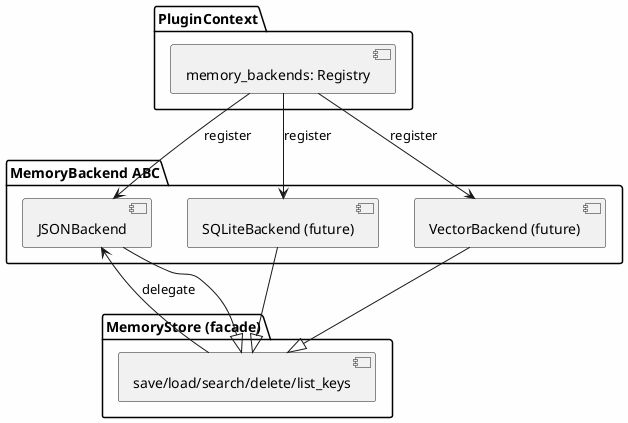

# merco MemoryBackend 插件化设计

> 最后更新: 2026-06-27

## 目标

将 MemoryStore 从单一 JSON 文件后端改为可拔插的 MemoryBackend 架构。MemoryStore 作为 facade 委托给 backend，插件可注册自定义存储后端（JSON/SQLite/Vector/Graph）。

**核心理念：MemoryStore 是稳定 API，MemoryBackend 是可拔插的实现。**

## 现状

- `MemoryStore` (`merco/memory/store.py`) — JSON 文件存储，save/load/delete/list_keys/search 全部硬编码
- `MemoryRecaller` (`merco/memory/recall.py`) — 使用 MemoryStore.search() 召回记忆
- `MemorySavePipeline` (`merco/memory/save_pipeline.py`) — 使用 MemoryStore.save() 存记忆
- 无后端抽象，无法切换存储方式

## 架构总览



## MemoryBackend ABC

```python
from abc import ABC, abstractmethod


class MemoryBackend(ABC):
    """记忆存储后端基类"""
    name: str = ""

    @abstractmethod
    def save(self, key: str, value, tags: list = None) -> None:
        """保存记忆"""
        ...

    @abstractmethod
    def load(self, key: str) -> dict | None:
        """加载记忆"""
        ...

    @abstractmethod
    def delete(self, key: str) -> None:
        """删除记忆"""
        ...

    @abstractmethod
    def list_keys(self, tag: str = None) -> list[str]:
        """列出所有记忆键"""
        ...

    @abstractmethod
    def search(self, query: str) -> list[dict]:
        """搜索记忆"""
        ...
```

**接口说明：**

| 方法 | 参数 | 返回 |
|------|------|------|
| `save` | key, value, tags | None |
| `load` | key | dict or None |
| `delete` | key | None |
| `list_keys` | tag (optional) | list[str] |
| `search` | query | list[dict] |

## JSONBackend

迁移现有 `MemoryStore` 的 JSON 文件逻辑到 `JSONBackend`：

```python
class JSONBackend(MemoryBackend):
    """JSON 文件后端 — 每记忆一个 .json 文件"""
    name = "json"

    def __init__(self, base_path: str):
        self.base_path = Path(base_path).expanduser()
        self.base_path.mkdir(parents=True, exist_ok=True)

    def save(self, key, value, tags=None):
        # 迁移现有 MemoryStore.save 逻辑
        ...

    def load(self, key):
        # 迁移现有 MemoryStore.load 逻辑
        ...

    def delete(self, key):
        # 迁移现有 MemoryStore.delete 逻辑
        ...

    def list_keys(self, tag=None):
        # 迁移现有 MemoryStore.list_keys 逻辑
        ...

    def search(self, query):
        # 迁移现有 MemoryStore.search 逻辑
        ...
```

## MemoryStore facade

```python
class MemoryStore:
    """持久化记忆存储 — facade，委托给 backend"""

    def __init__(self, base_path: str = None, backend: MemoryBackend = None):
        if backend:
            self.backend = backend
        else:
            self.backend = JSONBackend(base_path or "~/.merco/memory")

    def save(self, key: str, value, tags: list = None):
        return self.backend.save(key, value, tags)

    def load(self, key: str):
        return self.backend.load(key)

    def delete(self, key: str):
        return self.backend.delete(key)

    def list_keys(self, tag: str = None):
        return self.backend.list_keys(tag)

    def search(self, query: str):
        return self.backend.search(query)
```

**完全向后兼容：** 现有所有 `MemoryStore(path)` 调用不变，自动使用 JSONBackend。

## MemoryBackendRegistry

```python
class MemoryBackendRegistry:
    """MemoryBackend 注册表"""

    def __init__(self):
        self._backends: dict[str, MemoryBackend] = {}

    def register(self, backend: MemoryBackend) -> None:
        self._backends[backend.name] = backend

    def get(self, name: str) -> MemoryBackend | None:
        return self._backends.get(name)

    def list(self) -> list[MemoryBackend]:
        return list(self._backends.values())
```

## PluginContext 扩展

```python
class PluginContext:
    # 已有
    hooks: HookRegistry
    tool_registry: ToolRegistry
    agent_profiles: AgentProfileRegistry
    ...

    # 新增
    memory_backends: MemoryBackendRegistry
```

**插件注册 Backend 示例：**

```python
class SQLiteMemoryPlugin(Plugin):
    async def activate(self, ctx):
        ctx.memory_backends.register(SQLiteBackend("~/.merco/memory.db"))
```

## Config 切换 Backend

`merco.json`：

```json
{
  "memory": {
    "path": "~/.merco/memory",
    "backend": "json"
  }
}
```

`MercoConfig` 新增字段：

```python
memory_backend: str = "json"
```

序列化到 `to_dict()` / `_from_dict()` 的 `memory` 块。

## Agent 装配

```python
# Agent.__init__

# 注册内置 backend
self.memory_backends = MemoryBackendRegistry()
self.memory_backends.register(JSONBackend(config.memory_path))

# 暴露给插件
self._plugin_ctx.memory_backends = self.memory_backends

# 根据 config 选 backend
backend_name = config.memory_backend or "json"
selected_backend = self.memory_backends.get(backend_name) or self.memory_backends.get("json")

# MemoryStore 使用选中的 backend
self._memory_store = MemoryStore(backend=selected_backend)
```

## 文件结构

```
merco/
├── memory/
│   ├── backend.py              # MemoryBackend ABC + MemoryBackendRegistry
│   ├── backends/
│   │   ├── __init__.py
│   │   └── json_backend.py     # JSONBackend（迁移自 MemoryStore）
│   └── store.py                # MemoryStore facade（委托给 backend）
├── plugins/
│   └── base.py                 # PluginContext 新增 memory_backends
└── core/
    ├── agent.py                # 装配 registry + 选 backend
    └── config.py               # memory.backend 配置字段

tests/
└── memory/
    ├── test_backend.py
    └── test_backend_integration.py
```

## 测试计划

| 层 | 文件 | 用例 |
|---|------|------|
| Unit | `tests/memory/test_backend.py` | MemoryBackend ABC + JSONBackend CRUD/search + Registry |
| Unit | `tests/memory/test_store.py` | MemoryStore facade 委托正确性 |
| Integration | `tests/memory/test_backend_integration.py` | 现有 MemoryStore 测试全部通过（向后兼容） |

## 向后兼容

- 现有 `MemoryStore(base_path)` 签名不变
- 现有 `MemoryStore.save/load/delete/list_keys/search` API 不变
- 现有 `MemoryRecaller`、`MemorySavePipeline`、`MemorySaveStrategy` 不需要改
- 所有现有 memory 测试继续通过

## YAGNI 边界（不做）

- ❌ SQLiteBackend（本轮不做，只做 JSONBackend + 抽象层）
- ❌ VectorBackend
- ❌ 多 backend 同时写
- ❌ per-agent backend
- ❌ backend 迁移工具（从 JSON 迁移到 SQLite）
- ❌ backend 性能基准测试

## 与现有系统的关系

| 现有 | 改动 |
|------|------|
| `MemoryStore` | 改为 facade，委托给 backend |
| `MemoryRecaller` | 不改（仍调 MemoryStore.search） |
| `MemorySavePipeline` | 不改（仍调 MemoryStore.save） |
| `PluginContext` | 新增 memory_backends |
| `MercoConfig` | 新增 memory.backend 字段 |
| `Agent` | 装配 registry + 选 backend |

## merco MemoryBackend 的独特价值

1. **可拔插** — 插件注册新 backend，config 切换
2. **向后兼容** — 现有代码零改动
3. **与 Memory-Native Multi-Agent 路线对齐** — 后续 SQLite/Vector/Graph backend 在此基础上叠加
4. **与 AgentProfile 互补** — 后续可 per-agent 绑定专属 backend
