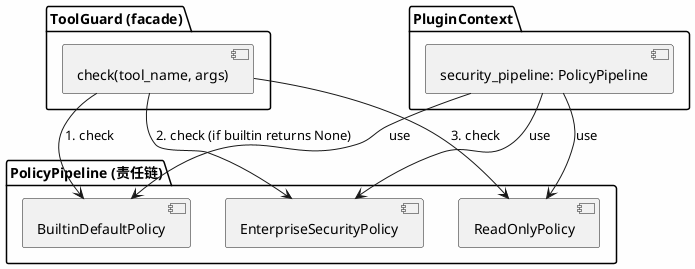

# merco PermissionPolicy 插件化设计

> 最后更新: 2026-06-27

## 目标

将 ToolGuard 的安全策略从硬编码规则链改为可拔插的 PermissionPolicy 架构。插件可注册自定义安全策略，PolicyPipeline 按责任链模式依次检查。

**核心理念：ToolGuard 是稳定 API，PermissionPolicy 是可拔插的策略实现。**

## 现状

- `ToolGuard` (`merco/sandbox/guard.py`) — 规则链 + 30 条默认规则 + SecurityChecker
- `ToolRegistry.execute()` (`merco/tools/registry.py`) — 调 `tool_guard.check()` 做安全守卫
- 规则主要通过 `_DEFAULT_RULES` 和 `config.sandbox_rules` 添加
- 不可插件注册

## 架构总览



## PermissionPolicy ABC

```python
from abc import ABC, abstractmethod
from merco.sandbox.guard import GuardResult


class PermissionPolicy(ABC):
    """安全策略基类"""
    name: str = ""

    @abstractmethod
    async def check(self, tool_name: str, arguments: dict) -> GuardResult | None:
        """检查工具是否可执行。

        返回 GuardResult → 决断（ALLOW/DENY/ASK），Pipeline 停止
        返回 None → 无意见，交给下一个策略
        """
        ...
```

## PolicyPipeline

```python
class PolicyPipeline:
    """安全策略责任链"""

    def __init__(self):
        self._policies: list[PermissionPolicy] = []

    def use(self, policy: PermissionPolicy) -> "PolicyPipeline":
        """注册策略（追加到链尾）"""
        self._policies.append(policy)
        return self

    async def check(self, tool_name: str, arguments: dict) -> GuardResult:
        """依次检查，首个返回非 None 的结果生效"""
        for policy in self._policies:
            result = await policy.check(tool_name, arguments)
            if result is not None:
                return result
        return GuardResult(action=GuardAction.ALLOW, command="")
```

## BuiltinDefaultPolicy

```python
class BuiltinDefaultPolicy(PermissionPolicy):
    """默认安全策略 — 包装 30 条默认规则 + SecurityChecker + mode logic"""
    name = "builtin_default"

    def __init__(self, mode: str = "ask", user_rules: list = None):
        self.mode = mode
        self._rules = []
        if user_rules:
            for r in user_rules:
                self._rules.append(GuardRule.from_dict(r) if isinstance(r, dict) else r)
        self._rules.extend(_DEFAULT_RULES)

    async def check(self, tool_name: str, arguments: dict) -> GuardResult | None:
        if self.mode == "auto":
            return GuardResult(action=GuardAction.ALLOW, command="")

        command = arguments.get("command", "")
        path = arguments.get("path", "")

        # SecurityChecker 文件路径检测
        if path and tool_name != "bash":
            ok, reason = SecurityChecker.check_file_path(path)
            if not ok:
                return GuardResult(action=GuardAction.DENY, command=path, reason=reason)

        # SecurityChecker 正则兜底
        if command:
            ok, reason = SecurityChecker.check_command(command)
            if not ok:
                return GuardResult(action=GuardAction.DENY, command=command, reason=reason)

        # 规则链匹配
        for rule in self._rules:
            if not self._tool_match(rule.tool, tool_name):
                continue
            if rule.pattern not in command:
                continue
            action = GuardAction(rule.action)
            return GuardResult(action=action, command=command, rule=rule)

        return GuardResult(action=GuardAction.ALLOW, command=command)
```

## ToolGuard facade

```python
class ToolGuard:
    """工具执行守卫 — facade，委托给 PolicyPipeline"""

    def __init__(self, policy_pipeline: PolicyPipeline):
        self._pipeline = policy_pipeline

    async def check(self, tool_name: str, arguments: dict) -> GuardResult:
        return await self._pipeline.check(tool_name, arguments)
```

保留 `rule()` 链式 API 用于向后兼容。

## PluginContext 扩展

```python
class PluginContext:
    # 已有
    hooks: HookRegistry
    memory_backends: MemoryBackendRegistry
    ...

    # 新增
    security_pipeline: PolicyPipeline
```

## 插件注册示例

```python
class ReadOnlyPlugin(Plugin):
    """只读模式 — 禁止所有写操作"""
    name = "readonly"
    version = "1.0.0"
    description = "禁止写文件和危险命令"

    async def activate(self, ctx):
        ctx.security_pipeline.use(ReadOnlyPolicy())


class ReadOnlyPolicy(PermissionPolicy):
    name = "readonly"

    async def check(self, tool_name, arguments):
        if tool_name in ("bash", "write_file", "edit_file"):
            cmd = arguments.get("command", "")
            if any(w in cmd for w in ("rm ", "sudo", "pip install", "apt ")):
                return GuardResult(action=GuardAction.DENY, command=cmd, reason="只读模式禁止此操作")
        return None  # 交给下一个策略
```

## 向后兼容

- `_DEFAULT_RULES` 和 `GuardRule` 不改
- `SecurityChecker` 不改
- `ToolRegistry.execute()` 仍调 `tool_guard.check()`，无需改动
- `config.sandbox_rules` 仍然生效（传给 BuiltinDefaultPolicy）
- `GuardResult` 和 `GuardAction` 不改

## 文件结构

```
merco/
├── sandbox/
│   ├── guard.py           # GuardRule/GuardResult/GuardAction (不改) + BuiltinDefaultPolicy + PolicyPipeline + ToolGuard facade
│   ├── policies/
│   │   └── __init__.py    # 策略实现
│   └── security.py        # SecurityChecker (不改)
├── plugins/
│   └── base.py            # PluginContext 新增 security_pipeline
└── core/
    └── agent.py           # Agent 装配 PolicyPipeline + BuiltinDefaultPolicy

tests/
└── sandbox/
    ├── test_policy.py
    └── test_policy_integration.py
```

## 测试计划

| 层 | 文件 | 用例 |
|---|------|------|
| Unit | `tests/sandbox/test_policy.py` | PermissionPolicy ABC + PolicyPipeline 责任链 + BuiltinDefaultPolicy |
| Integration | `tests/sandbox/test_policy_integration.py` | 插件注册策略 + ToolGuard facade + ToolRegistry.check |

## YAGNI 边界（不做）

- ❌ 策略优先级排序（按注册顺序）
- ❌ 策略条件执行（全量执行）
- ❌ 策略审计日志

## merco PermissionPolicy 的独特价值

1. **责任链** — ALLOW/DENY 立停，None 交给下一个，符合安全分层
2. **零侵入** — ToolRegistry 和 ToolGuard API 不变
3. **向后兼容** — 30 条默认规则 + SecurityChecker 完整保留
4. **插件友好** — 安全策略可以打包为插件分发
