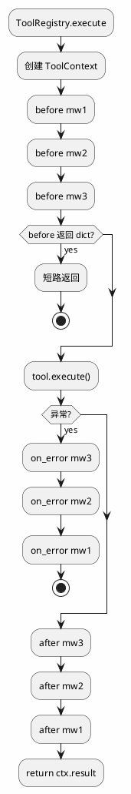

# merco ToolRegistry Middleware 设计

> 最后更新: 2026-06-27
> Phase 2.2: ToolRegistry 安全守卫解耦

## 目标

将 `ToolRegistry.execute()` 中硬编码的安全守卫和错误处理改为可组合的 ToolMiddleware 链。ToolRegistry 只负责工具路由，安全/错误/审计/耗时等逻辑通过中间件外挂。

## 现状

`merco/tools/registry.py` 当前：

```python
async def execute(self, tool_name, **kwargs):
    tool = self.get(tool_name)
    if tool is None:
        return {"error": ...}

    from merco.sandbox import tool_guard
    result = await tool_guard.check(tool_name, kwargs)
    ...

    try:
        return await tool.execute(**kwargs)
    except Exception as e:
        from merco.core.self_healing import tool_error
        return tool_error(e, ...)
```

问题：

- `tools/registry.py` 反向依赖 sandbox
- `tools/registry.py` 反向依赖 core.self_healing
- 插件无法在工具执行前后注入逻辑
- edit.py 的 confirm/snapshot 后续也无法迁移到统一层

## 核心设计

### ToolContext

```python
@dataclass
class ToolContext:
    tool_name: str
    arguments: dict
    tool: BaseTool | None = None
    result: dict | None = None
    error: Exception | None = None
    metadata: dict = field(default_factory=dict)
```

### ToolMiddleware ABC

```python
class ToolMiddleware(ABC):
    name: str = ""

    async def before(self, ctx: ToolContext) -> ToolContext | dict | None:
        """执行前。返回 dict = 短路结果；返回 ctx/None = 继续"""
        return None

    async def after(self, ctx: ToolContext) -> ToolContext | dict | None:
        """执行后。可修改 result。返回 dict = 替换结果"""
        return None

    async def on_error(self, ctx: ToolContext) -> dict | None:
        """异常处理。返回 dict = 错误结果；None = 交给下一个"""
        return None
```

### ToolMiddlewareChain

```python
class ToolMiddlewareChain:
    def __init__(self):
        self._middlewares: list[ToolMiddleware] = []

    def use(self, middleware: ToolMiddleware) -> "ToolMiddlewareChain":
        self._middlewares.append(middleware)
        return self

    async def execute(self, ctx: ToolContext, call_tool) -> dict:
        # before: 正序
        for mw in self._middlewares:
            r = await mw.before(ctx)
            if isinstance(r, dict):
                return r
            if isinstance(r, ToolContext):
                ctx = r

        try:
            ctx.result = await call_tool()
        except Exception as e:
            ctx.error = e
            # on_error: 逆序
            for mw in reversed(self._middlewares):
                r = await mw.on_error(ctx)
                if isinstance(r, dict):
                    return r
            raise

        # after: 逆序（洋葱模型）
        for mw in reversed(self._middlewares):
            r = await mw.after(ctx)
            if isinstance(r, dict):
                ctx.result = r
            elif isinstance(r, ToolContext):
                ctx = r
        return ctx.result
```

### 执行顺序



## 内置中间件

### GuardMiddleware

```python
class GuardMiddleware(ToolMiddleware):
    name = "guard"

    def __init__(self, guard):
        self.guard = guard

    async def before(self, ctx):
        result = await self.guard.check(ctx.tool_name, ctx.arguments)
        if result.action == GuardAction.DENY:
            return {"error": f"操作被安全守卫拒绝: {result.reason}", "tool": ctx.tool_name}
        if result.action == GuardAction.ASK:
            raise GuardConfirmationRequired(result)
        return None
```

### ErrorHandlingMiddleware

```python
class ErrorHandlingMiddleware(ToolMiddleware):
    name = "error_handling"

    async def on_error(self, ctx):
        from merco.core.self_healing import tool_error
        return tool_error(ctx.error, ctx.tool_name, getattr(ctx.tool, 'parameters', None))
```

### TimingMiddleware（预留）

后续可记录工具耗时到 `ctx.metadata`，由 Observer 使用。

## ToolRegistry 改造

```python
class ToolRegistry:
    def __init__(self):
        self._tools = {}
        self._middleware = ToolMiddlewareChain()

    def use(self, middleware):
        self._middleware.use(middleware)
        return self

    async def execute(self, tool_name, **kwargs):
        tool = self.get(tool_name)
        if tool is None:
            return {"error": f"工具 '{tool_name}' 不存在"}

        ctx = ToolContext(tool_name=tool_name, arguments=kwargs, tool=tool)
        return await self._middleware.execute(ctx, lambda: tool.execute(**kwargs))
```

## Agent 装配

```python
from merco.tools.middleware import GuardMiddleware, ErrorHandlingMiddleware

self.tool_registry.use(GuardMiddleware(self.guard))
self.tool_registry.use(ErrorHandlingMiddleware())
```

## 插件扩展

```python
class AuditPlugin(Plugin):
    async def activate(self, ctx):
        ctx.tool_registry.use(AuditMiddleware())
```

## 向后兼容

- `ToolRegistry.register/get/list_tools/get_definitions` 不变
- `ToolRegistry.execute(tool_name, **kwargs)` 签名不变
- Guard 行为不变：DENY 返回错误 dict，ASK 抛 `GuardConfirmationRequired`
- 工具异常仍返回 `tool_error()` 结构化结果

## 文件结构

```
merco/tools/
├── registry.py          # ToolRegistry 路由 + use(middleware)
├── middleware.py        # ToolContext, ToolMiddleware, ToolMiddlewareChain, GuardMiddleware, ErrorHandlingMiddleware
└── ...

tests/tools/
└── test_middleware.py

tests/integration/
└── test_tool_middleware.py
```

## 测试计划

| 测试 | 目的 |
|------|------|
| before 短路返回 dict | middleware 可拦截 |
| before 正序执行 | 顺序正确 |
| after 逆序执行 | 洋葱模型正确 |
| on_error 逆序处理 | 错误处理正确 |
| GuardMiddleware DENY/ASK/ALLOW | 行为与旧 registry 一致 |
| ErrorHandlingMiddleware | 工具异常结构化 |
| ToolRegistry.execute | 签名不变，行为不变 |

## 非目标

- 不移动 edit.py confirm/snapshot（Phase 2.3 单独做）
- 不实现 TimingMiddleware
- 不做 middleware priority（按注册顺序）
- 不做 middleware disable/enable
