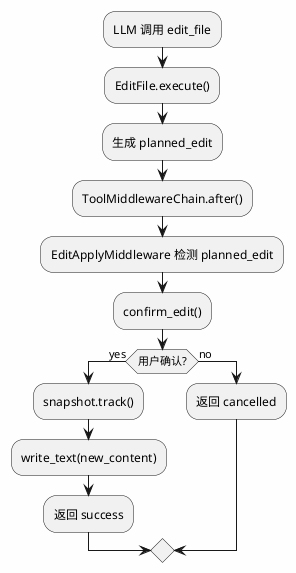

# merco EditFile 解耦设计

> 最后更新: 2026-06-28
> Phase 2.3: edit.py 移除 sandbox 直接依赖

## 目标

让 `merco/tools/edit.py` 只负责 SEARCH/REPLACE 规划，不再直接依赖 sandbox.confirm / snapshot。确认、快照、写入由 ToolMiddleware 层处理。

## 现状

`EditFile.execute()` 当前直接：

1. 读取文件
2. 校验 search 唯一
3. 生成 diff
4. 调 `confirm_edit()`
5. 调 `snapshot.track()`
6. 写文件

问题：

- `edit.py` 直接 import `merco.sandbox.confirm`
- `edit.py` 直接 import `merco.sandbox.snapshot`
- 工具逻辑和安全/UI/快照逻辑耦合
- 插件无法替换确认方式

## 设计：EditPlanner + EditApplyMiddleware

### EditFile 只做 planning

```python
class EditFile(BaseTool):
    async def execute(self, path, search, replace):
        # 1. 文件存在检查
        # 2. search 唯一性校验
        # 3. 生成 new_content + diff
        # 4. 返回 planned_edit，不写文件
        return {
            "planned_edit": True,
            "path": path,
            "old_content": old_content,
            "new_content": new_content,
            "diff": diff_text,
        }
```

### EditApplyMiddleware 负责 confirm/snapshot/write

```python
class EditApplyMiddleware(ToolMiddleware):
    name = "edit_apply"

    async def after(self, ctx):
        result = ctx.result or {}
        if not result.get("planned_edit"):
            return None

        path = result["path"]
        old_content = result["old_content"]
        new_content = result["new_content"]
        diff = result["diff"]

        approved = await confirm_edit(diff, path, 1, old_content, new_content, self.diff_view)
        if not approved:
            return {"success": False, "path": path, "message": "用户已取消修改", "diff": diff}

        snapshot.track(path, old_content)
        Path(path).write_text(new_content, encoding="utf-8")
        return {"success": True, "path": path, "diff": diff, "message": f"已修改 `{path}`"}
```

## 数据流



## 责任划分

| 组件 | 职责 |
|------|------|
| `EditFile` | SEARCH/REPLACE 校验、diff 生成、返回 planned_edit |
| `EditApplyMiddleware` | 确认、快照、写入、返回最终结果 |
| `ToolRegistry` | 路由 + 中间件链 |
| `Agent` | 装配 EditApplyMiddleware |

## Agent 装配

```python
from merco.tools.middleware import EditApplyMiddleware

self.tool_registry.use(EditApplyMiddleware(diff_view=config.diff_view))
```

中间件顺序建议：

```python
self.tool_registry.use(GuardMiddleware(self.guard))
self.tool_registry.use(EditApplyMiddleware(diff_view=config.diff_view))
self.tool_registry.use(ErrorHandlingMiddleware())
```

因为：

- Guard 先判断是否允许编辑
- EditApply 在 tool 执行后应用 planned edit
- ErrorHandling 包底处理异常

## 向后兼容

对 LLM 来说：

- `edit_file` 输入 schema 不变
- 成功返回格式不变：`success/path/diff/message`
- 用户取消返回格式不变
- 文件无变化返回格式不变

内部变化：

- `planned_edit` 不会暴露给 LLM（被 middleware 消费）

## 非目标

- 不改 diff 生成算法
- 不改 confirm UI
- 不改 snapshot 实现
- 不做 auto-apply policy
- 不拆分更多 edit 工具

## 测试计划

| 测试 | 目的 |
|------|------|
| EditFile 返回 planned_edit | edit.py 不写文件 |
| EditApplyMiddleware 确认后写文件 | middleware 应用 edit |
| EditApplyMiddleware 取消后不写文件 | 行为保持 |
| 无变化直接 success | 不走 middleware 写入 |
| edit.py 不再 import sandbox | 解耦验证 |

## 文件

```
merco/tools/edit.py          # 移除 confirm_edit/snapshot import，返回 planned_edit
merco/tools/middleware.py    # 新增 EditApplyMiddleware
merco/core/agent.py          # 装配 EditApplyMiddleware
tests/tools/test_edit_middleware.py
```
